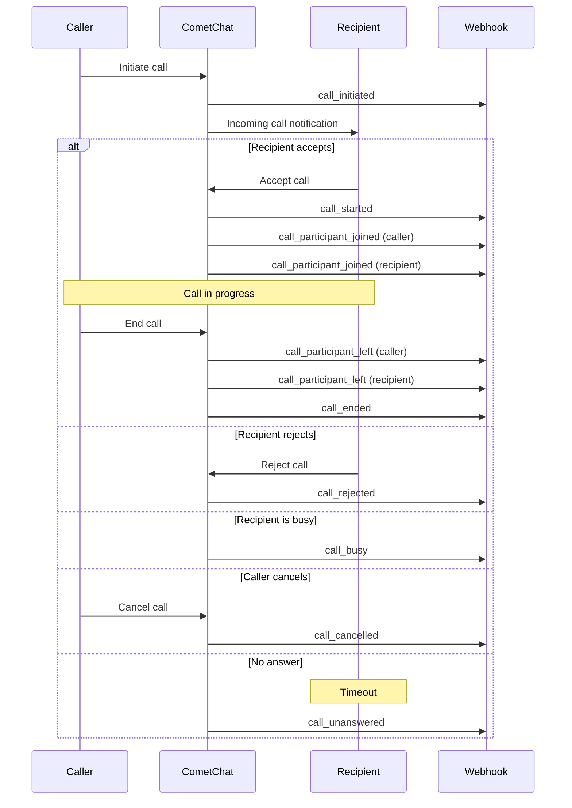
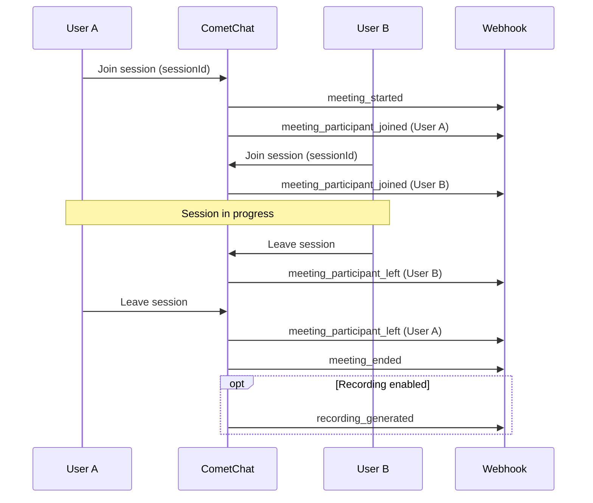

CometChat sends real-time webhook notifications throughout the lifecycle of your ringing calls and call sessions. Use these to track activity, trigger backend workflows, build analytics dashboards, or keep your systems in sync.

<Info>
To configure webhooks for your app, see the [Webhook Management](/fundamentals/webhooks-management) guide. For general webhook concepts, see the [Webhooks Overview](/fundamentals/webhooks-overview).
</Info>

## How It Works

When a calling event occurs (a call is initiated, a participant joins, a recording is generated, etc.), CometChat sends an HTTP POST request to your configured webhook endpoint with a JSON payload describing the event.

Each payload includes:
- `trigger` — the event name (e.g. `call_initiated`, `meeting_ended`)
- `data` — event-specific payload with call/session details
- `appId` and `region` — your CometChat app identifiers
- `webhook` — the webhook configuration ID

## Webhook Event Flows

### Ringing Flow

### Call Session Flow

## Event Categories

CometChat calling webhooks are split into two categories based on how the call was initiated:

<CardGroup cols={2}>
  <Card title="Ringing Events" icon="phone-volume" href="/calls/webhooks-ringing">
    Triggered when using the **Ringing flow** — where a caller initiates a call and the recipient receives an incoming call notification with accept/reject options.

    Covers the full call lifecycle: initiation, busy, cancelled, rejected, unanswered, and session start/end.
  </Card>
  <Card title="Call Session Events" icon="video" href="/calls/webhooks-call-session">
    Triggered when using **Call Sessions** — where participants join a session directly without a ringing flow.

    Covers session start/end, participant join/leave, and recording generation.
  </Card>
</CardGroup>

## Idempotency

Webhooks may be delivered more than once due to network retries. Each event includes an idempotency key composed of multiple fields from the payload. Use this key to deduplicate events on your end.

See the individual event pages for the specific idempotency key for each event.

## Quick Reference

### Ringing Events

| Event | Description |
|-------|-------------|
| `call_initiated` | A user initiates a call to another user or group |
| `call_started` | The call session begins (first participant joins) |
| `call_participant_joined` | A participant joins the active call |
| `call_participant_left` | A participant leaves the active call |
| `call_ended` | The call session ends |
| `call_busy` | Recipient is on another call (1-on-1 only) |
| `call_cancelled` | Caller cancels before the call is answered |
| `call_rejected` | Recipient explicitly rejects the call (1-on-1 only) |
| `call_unanswered` | Call goes unanswered (group: no one joins) |

### Call Session Events

| Event | Description |
|-------|-------------|
| `meeting_started` | A call session begins |
| `meeting_participant_joined` | A participant joins the session |
| `meeting_participant_left` | A participant leaves the session |
| `meeting_ended` | The session ends |
| `recording_generated` | A recording is ready for download |
