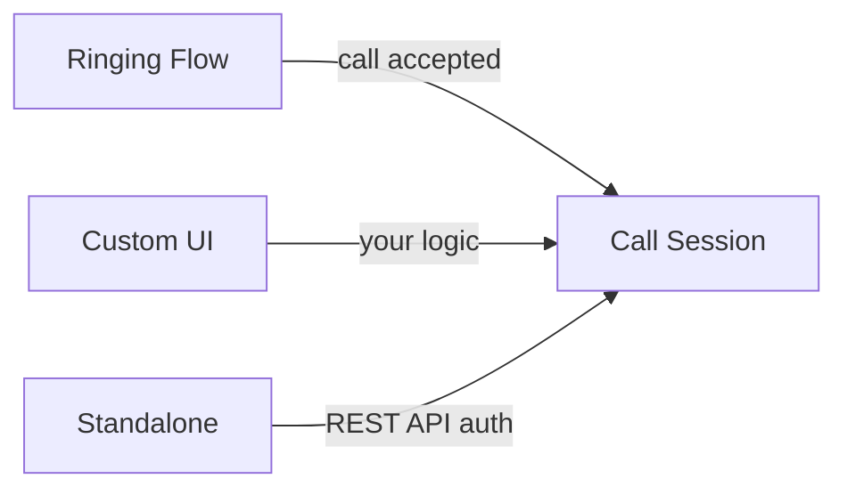

<Accordion title="AI Integration Quick Reference">

Choose your calling approach:
- **Ringing** → [Default Call](/sdk/flutter/default-call) — Full call flow with notifications, accept/reject
- **Call Session** → [Direct Call](/sdk/flutter/direct-call) — Session-based calling with custom UI
- **Standalone** → [Standalone Calling](/sdk/flutter/standalone-calling) — Calls SDK only, no Chat SDK needed

```yaml
# Install Calls SDK
dependencies:
  cometchat_calls_sdk: ^4.2.2
```

**Features:** Recording, Presenter Mode, Video View Customization, Call Logs, Session Timeout
</Accordion>

CometChat provides three ways to add voice and video calling to your Flutter app. Which one you pick depends on how much of the call flow you want CometChat to handle vs. building yourself.

- **Voice & Video Calls** — High-quality 1-on-1 and group calling with adaptive bitrate
- **Screen Sharing** — Share your screen during calls for collaboration
- **Call Recording** — Record calls and access recordings later
- **Call Logs** — Track call history with detailed metadata
- **Ringing & Notifications** — Built-in call ringing flow with accept/reject
- **Customizable UI** — Presenter mode and video view customization

1. CometChat SDK installed and configured. See the [Setup](/sdk/flutter/setup) guide.
2. CometChat Calls SDK added to your project:

```yaml
dependencies:
  cometchat_calls_sdk: ^4.0.0
```

For detailed setup instructions, see the [Calls SDK Setup](/sdk/flutter/calling-setup) guide.

## Choose Your Approach

### Ringing (Full Call Flow)

The complete calling experience — incoming/outgoing call UI, accept/reject/cancel, push notifications, and integration with CometChat messaging. Use this when you want CometChat to handle the entire call lifecycle.

**Flow:** Initiate call → Receiver gets notified → Accept/Reject → Start session

<Card title="Get started with Ringing" icon="phone-volume" href="/sdk/flutter/default-call">
  Implement the complete ringing call flow
</Card>

### Call Session (Session Management)

Manages the actual call session — generating tokens, starting/ending sessions, configuring the call UI, and handling in-call events. The Ringing flow uses this under the hood after a call is accepted. You can also use it directly if you want to build your own call initiation logic.

**Flow:** Generate token → Start session → Manage call → End session

<Card title="Get started with Call Session" icon="video" href="/sdk/flutter/direct-call">
  Start and manage call sessions
</Card>

### Standalone Calling (No Chat SDK)

Calling without the Chat SDK. You handle user authentication via the REST API and use only the Calls SDK. Ideal when you need voice/video but not the full chat infrastructure.

**Flow:** Get auth token via REST API → Generate call token → Start session

<Card title="Get started with Standalone Calling" icon="phone-flip" href="/sdk/flutter/standalone-calling">
  Implement calling without the Chat SDK
</Card>

### How They Relate



All three approaches converge on the Call Session layer to manage the actual media connection. The difference is how you get there — CometChat's ringing flow, your own UI, or standalone without the Chat SDK.

## Features

<CardGroup cols={2}>
  <Card title="Calling SDK v4 (Stable)" icon="phone" href="/calls/v4/flutter/overview">
    Production-ready calling SDK with full feature set including setup, ringing, call sessions, recording, and more.
  </Card>
  <Card title="Calling SDK v5 (Beta)" icon="rocket" href="/calls/flutter/overview">
    Next-generation calling SDK with improved architecture, better performance, and new features. Currently in beta.
  </Card>
</CardGroup>

## Next Steps

<CardGroup cols={2}>
  <Card title="Calling Setup" icon="gear" href="/sdk/flutter/calling-setup">
    Install and configure the CometChat Calls SDK
  </Card>
  <Card title="Ringing" icon="phone" href="/sdk/flutter/default-call">
    Implement the complete ringing call flow
  </Card>
  <Card title="Call Session" icon="video" href="/sdk/flutter/direct-call">
    Start and manage call sessions directly
  </Card>
  <Card title="Standalone Calling" icon="phone-flip" href="/sdk/flutter/standalone-calling">
    Implement calling without the Chat SDK
  </Card>
</CardGroup>
