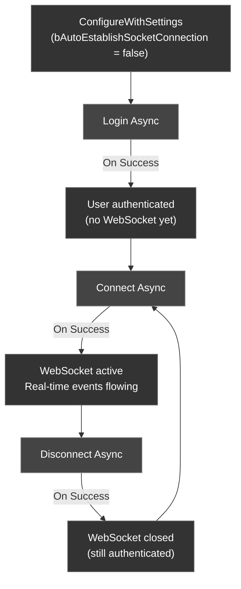

Beyond the basic `Configure` call, the CometChat Unreal SDK offers advanced configuration for custom hosts, manual connection management, and runtime state queries.

---

## ConfigureWithSettings

Use `ConfigureWithSettings` instead of `Configure` when you need control over connection behavior, custom hosts, or presence subscription settings.

<Tabs>
<Tab title="Blueprint">
1. Create an `FCometChatAppSettings` struct
2. Set the desired properties (region, custom hosts, auto-connect behavior)
3. Call **Configure With Settings** on the CometChat Subsystem with your App ID and the settings struct
</Tab>
<Tab title="C++">
```cpp
void AMyActor::InitCometChat()
{
    UCometChatSubsystem* Chat = GetGameInstance()->GetSubsystem<UCometChatSubsystem>();

    FCometChatAppSettings Settings;
    Settings.Region = TEXT("us");
    Settings.bAutoEstablishSocketConnection = false; // Manual connection mode
    Settings.SubscriptionType = TEXT("allUsers");

    Chat->ConfigureWithSettings(TEXT("YOUR_APP_ID"), Settings);
}
```
</Tab>
</Tabs>

### FCometChatAppSettings

| Property | Type | Default | Description |
| -------- | ---- | ------- | ----------- |
| `Region` | `FString` | — | App region (`us` or `eu`) |
| `SubscriptionType` | `FString` | — | Presence subscription type (`allUsers`, `roles`, `friends`) |
| `Roles` | `TArray<FString>` | — | Roles to subscribe to (when `SubscriptionType` is `roles`) |
| `AdminHost` | `FString` | — | Custom admin API host URL |
| `ClientHost` | `FString` | — | Custom client/WebSocket host URL |
| `bAutoEstablishSocketConnection` | `bool` | `true` | Automatically connect WebSocket on login |

<Info>
When `bAutoEstablishSocketConnection` is `true` (default), the SDK connects the WebSocket immediately after a successful login. Set to `false` if you want to control when the connection is established — useful for splash screens or loading flows.
</Info>

---

## Manual Connection Management

When `bAutoEstablishSocketConnection` is `false`, use the async connection nodes to control the WebSocket lifecycle.

### Connect

Manually establish the WebSocket connection after login.

<Tabs>
<Tab title="Blueprint">
Call the **Connect Async** node after login succeeds. Handle **On Success** to know the connection is ready.
</Tab>
<Tab title="C++">
```cpp
void AMyActor::ManualConnect()
{
    auto* Action = UCometChatConnectAction::Connect(this);
    Action->OnSuccess.AddDynamic(this, &AMyActor::HandleConnected);
    Action->OnFailure.AddDynamic(this, &AMyActor::HandleError);
    Action->Activate();
}

void AMyActor::HandleConnected()
{
    UE_LOG(LogTemp, Log, TEXT("WebSocket connected — ready to receive events"));
}
```
</Tab>
</Tabs>

### Disconnect

Manually close the WebSocket connection without logging out.

<Tabs>
<Tab title="Blueprint">
Call the **Disconnect Async** node. The user remains authenticated but won't receive real-time events.
</Tab>
<Tab title="C++">
```cpp
void AMyActor::ManualDisconnect()
{
    auto* Action = UCometChatDisconnectAction::Disconnect(this);
    Action->OnSuccess.AddDynamic(this, &AMyActor::HandleDisconnected);
    Action->OnFailure.AddDynamic(this, &AMyActor::HandleError);
    Action->Activate();
}
```
</Tab>
</Tabs>

### Ping

Verify the connection is alive by sending a ping to the server.

<Tabs>
<Tab title="Blueprint">
Call the **Ping Async** node. **On Success** means the server responded — connection is healthy.
</Tab>
<Tab title="C++">
```cpp
void AMyActor::PingServer()
{
    auto* Action = UCometChatPingAction::Ping(this);
    Action->OnSuccess.AddDynamic(this, &AMyActor::HandlePingSuccess);
    Action->OnFailure.AddDynamic(this, &AMyActor::HandlePingFailed);
    Action->Activate();
}
```
</Tab>
</Tabs>

---

## Connection Status

Query the current WebSocket connection state at any time.

<Tabs>
<Tab title="Blueprint">
Call **Get Connection Status** on the CometChat Subsystem. Returns an `ECometChatConnectionState` enum.
</Tab>
<Tab title="C++">
```cpp
void AMyActor::CheckConnection()
{
    UCometChatSubsystem* Chat = GetGameInstance()->GetSubsystem<UCometChatSubsystem>();
    ECometChatConnectionState State = Chat->GetConnectionStatus();

    switch (State)
    {
    case ECometChatConnectionState::Connected:
        UE_LOG(LogTemp, Log, TEXT("Connected"));
        break;
    case ECometChatConnectionState::Connecting:
        UE_LOG(LogTemp, Log, TEXT("Connecting..."));
        break;
    case ECometChatConnectionState::Disconnected:
        UE_LOG(LogTemp, Warning, TEXT("Disconnected"));
        break;
    case ECometChatConnectionState::FeatureThrottled:
        UE_LOG(LogTemp, Warning, TEXT("Feature throttled"));
        break;
    }
}
```
</Tab>
</Tabs>

### ECometChatConnectionState

| Value | Description |
| ----- | ----------- |
| `Connected` | WebSocket is active and receiving events |
| `Connecting` | SDK is attempting to establish the connection |
| `Disconnected` | WebSocket is closed |
| `FeatureThrottled` | A feature is being rate-limited by the server |

---

## Authentication State

### IsLoggedIn

Check whether a user is currently authenticated.

<Tabs>
<Tab title="Blueprint">
Call **Is Logged In** on the CometChat Subsystem. Returns a `bool`.
</Tab>
<Tab title="C++">
```cpp
bool bLoggedIn = Chat->IsLoggedIn();
```
</Tab>
</Tabs>

### GetLoggedInUser

Retrieve the currently authenticated user's profile.

<Tabs>
<Tab title="Blueprint">
<Frame>
  
</Frame>

Call **Get Logged In User** on the CometChat Subsystem. Returns an `FCometChatUser`.
</Tab>
<Tab title="C++">
```cpp
FCometChatUser CurrentUser = Chat->GetLoggedInUser();
UE_LOG(LogTemp, Log, TEXT("Logged in as: %s (%s)"), *CurrentUser.Name, *CurrentUser.Uid);
```
</Tab>
</Tabs>

---

## Connection Flow (Manual Mode)



<Tip>
**When to use manual mode**: If your game has a loading screen or lobby where you don't need real-time events yet, configure with `bAutoEstablishSocketConnection = false`, then call `Connect` when the player enters the chat-enabled area. This saves bandwidth and server resources.
</Tip>

---

## Next Steps

<CardGroup cols={2}>
  <Card title="Authentication" icon="lock" href="/sdk/unreal/authentication">
    Log users in with Auth Key or Auth Token.
  </Card>
  <Card title="Real-Time Events" icon="bolt" href="/sdk/unreal/real-time-events">
    Listen for connection state changes and other events.
  </Card>
</CardGroup>
