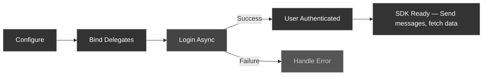
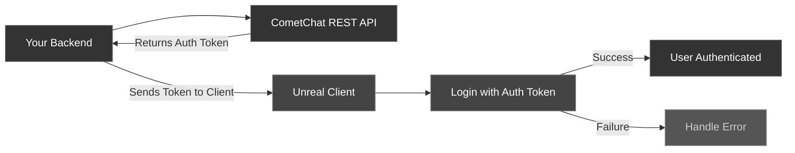

## Create User

Before you log in a user, the user must exist in CometChat.

1. **For proof of concept / MVPs**: Create users via the [CometChat Dashboard](https://app.cometchat.com).
2. **For production apps**: Use the [Create User REST API](https://api-explorer.cometchat.com/reference/creates-user) when your user signs up.

<Note>
**Sample Users**

CometChat provides 5 pre-created users for testing: `cometchat-uid-1`, `cometchat-uid-2`, `cometchat-uid-3`, `cometchat-uid-4`, and `cometchat-uid-5`.
</Note>

---

## Login using Auth Key

<Info>
This authentication method is ideal for **proof-of-concept** development or early-stage apps. For production environments, we recommend using an **Auth Token** instead of an Auth Key for enhanced security.
</Info>

### Auth Flow



<Tabs>
<Tab title="Blueprint">
<Frame>
  
</Frame>

1. Get a reference to the **CometChat Subsystem**
2. Call the **Login Async** node
3. Wire the **On Success** and **On Failure** pins

| Parameter | Type | Description |
| --------- | ---- | ----------- |
| Uid | `FString` | The unique ID of the user to log in |
| Auth Key | `FString` | Your CometChat Auth Key |
</Tab>
<Tab title="C++">
```cpp
#include "CometChatSubsystem.h"
#include "AsyncActions/CometChatLoginAction.h"

void AMyActor::BeginPlay()
{
    Super::BeginPlay();

    // 1. Configure the SDK (do this once)
    UCometChatSubsystem* Chat = GetGameInstance()->GetSubsystem<UCometChatSubsystem>();
    Chat->Configure(TEXT("YOUR_APP_ID"), TEXT("us"));

    // 2. Bind real-time events before login
    Chat->OnMessageReceived.AddDynamic(this, &AMyActor::OnMessage);

    // 3. Login
    if (!Chat->IsLoggedIn())
    {
        auto* Login = UCometChatLoginAction::LoginAsync(
            this,
            TEXT("cometchat-uid-1"),
            TEXT("YOUR_AUTH_KEY")
        );
        Login->OnSuccess.AddDynamic(this, &AMyActor::OnLoginSuccess);
        Login->OnFailure.AddDynamic(this, &AMyActor::OnLoginFailed);
        Login->Activate();
    }
}

void AMyActor::OnLoginSuccess()
{
    UE_LOG(LogTemp, Log, TEXT("Login successful!"));
}

void AMyActor::OnLoginFailed(const FString& Error)
{
    UE_LOG(LogTemp, Error, TEXT("Login failed: %s"), *Error);
}
```
</Tab>
</Tabs>

<Warning>
**UID format**: UIDs can be alphanumeric with underscores and hyphens. Spaces, punctuation, and other special characters are not allowed.
</Warning>

---

## Login using Auth Token

<Info>
This is the **recommended authentication method for production** apps. Auth Tokens are generated server-side using the CometChat REST API and provide enhanced security since your Auth Key is never exposed on the client.
</Info>

### How Auth Tokens Work



1. Your backend calls the [Create Auth Token REST API](https://api-explorer.cometchat.com/reference/create-authtoken) with the user's UID
2. The API returns an Auth Token
3. Your backend sends the token to the Unreal client
4. The client calls `LoginWithAuthTokenAsync` with the token

<Tabs>
<Tab title="Blueprint">
<Frame>
  
</Frame>

1. Get a reference to the **CometChat Subsystem**
2. Call the **Login With Auth Token Async** node
3. Wire the **On Success** and **On Failure** pins

| Parameter | Type | Description |
| --------- | ---- | ----------- |
| Auth Token | `FString` | The auth token received from your backend |
</Tab>
<Tab title="C++">
```cpp
#include "CometChatSubsystem.h"
#include "AsyncActions/CometChatLoginWithAuthTokenAction.h"

void AMyActor::LoginWithToken(const FString& AuthToken)
{
    UCometChatSubsystem* Chat = GetGameInstance()->GetSubsystem<UCometChatSubsystem>();

    if (!Chat->IsLoggedIn())
    {
        auto* Login = UCometChatLoginWithAuthTokenAction::LoginWithAuthTokenAsync(
            this,
            AuthToken
        );
        Login->OnSuccess.AddDynamic(this, &AMyActor::OnLoginSuccess);
        Login->OnFailure.AddDynamic(this, &AMyActor::OnLoginFailed);
        Login->Activate();
    }
}

void AMyActor::OnLoginSuccess()
{
    UE_LOG(LogTemp, Log, TEXT("Auth token login successful!"));
}

void AMyActor::OnLoginFailed(const FString& Error)
{
    UE_LOG(LogTemp, Error, TEXT("Auth token login failed: %s"), *Error);
}
```
</Tab>
</Tabs>

<Warning>
**Security**: Never hardcode Auth Tokens in your client. Always fetch them from your backend at runtime.
</Warning>

---

## Check Login State

Before performing operations, you can check whether a user is currently logged in.

<Tabs>
<Tab title="Blueprint">
<Frame>
  
</Frame>

Call the **Get Logged In User** node on the CometChat Subsystem. It returns an `FCometChatUser` — if the `Uid` is empty, no user is logged in.
</Tab>
<Tab title="C++">
```cpp
UCometChatSubsystem* Chat = GetGameInstance()->GetSubsystem<UCometChatSubsystem>();

if (Chat->IsLoggedIn())
{
    // User is authenticated — safe to send messages, fetch data, etc.
}
```
</Tab>
</Tabs>

---

## Logout

Logs the current user out and disconnects the real-time WebSocket.

<Tabs>
<Tab title="Blueprint">
<Frame>
  
</Frame>

Call the **Logout Async** node on the CometChat Subsystem. Wire the **On Success** and **On Failure** pins.
</Tab>
<Tab title="C++">
```cpp
#include "AsyncActions/CometChatLogoutAction.h"

void AMyActor::PerformLogout()
{
    auto* Logout = UCometChatLogoutAction::LogoutAsync(this);
    Logout->OnSuccess.AddDynamic(this, &AMyActor::OnLogoutSuccess);
    Logout->OnFailure.AddDynamic(this, &AMyActor::OnLogoutFailed);
    Logout->Activate();
}
```
</Tab>
</Tabs>

---

## Shutdown

To fully tear down the SDK (e.g., when your game is closing), call **Shutdown** on the Subsystem. This releases all resources and closes connections.

<Tabs>
<Tab title="Blueprint">
Call the **Shutdown** node on the CometChat Subsystem.
</Tab>
<Tab title="C++">
```cpp
UCometChatSubsystem* Chat = GetGameInstance()->GetSubsystem<UCometChatSubsystem>();
Chat->Shutdown();
```
</Tab>
</Tabs>

<Info>
You typically don't need to call Shutdown manually — the Subsystem's `Deinitialize` handles cleanup when the game instance is destroyed.
</Info>

---

## Next Steps

<CardGroup cols={2}>
  <Card title="Overview" icon="house" href="/sdk/unreal/overview">
    Return to the SDK overview and architecture.
  </Card>
  <Card title="Send a Message" icon="paper-plane" href="/sdk/unreal/send-message">
    Send your first text message after logging in.
  </Card>
  <Card title="Real-Time Events" icon="bolt" href="/sdk/unreal/real-time-events">
    Listen for incoming messages and presence updates.
  </Card>
</CardGroup>
