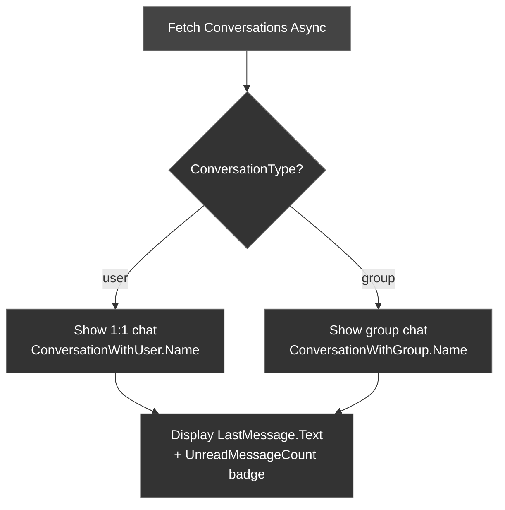

Conversations represent the chat threads a user is part of — both 1:1 and group. Use the **Fetch Conversations Async** node to retrieve the list with unread counts, last messages, and metadata.

---

## Fetch Conversations

<Tabs>
<Tab title="Blueprint">
<Frame>
  
</Frame>

1. Create an `FCometChatConversationsRequest` struct
2. Set filters (conversation type, tags, unread only, etc.)
3. Call the **Fetch Conversations Async** node
4. On Success, iterate the returned `TArray<FCometChatConversation>`
</Tab>
<Tab title="C++">
```cpp
void AMyActor::FetchConversations()
{
    FCometChatConversationsRequest Request;
    Request.Limit = 20;
    // Request.ConversationType = TEXT("group"); // optional filter

    auto* Action = UCometChatFetchConversationsAction::FetchConversations(this, Request);
    Action->OnSuccess.AddDynamic(this, &AMyActor::HandleConversations);
    Action->OnFailure.AddDynamic(this, &AMyActor::HandleError);
    Action->Activate();
}

void AMyActor::HandleConversations(const TArray<FCometChatConversation>& Conversations)
{
    for (const auto& Conv : Conversations)
    {
        FString Name = Conv.ConversationType == TEXT("user")
            ? Conv.ConversationWithUser.Name
            : Conv.ConversationWithGroup.Name;

        UE_LOG(LogTemp, Log, TEXT("%s — Unread: %d — Last: %s"),
            *Name, Conv.UnreadMessageCount, *Conv.LastMessage.Text);
    }
}
```
</Tab>
</Tabs>

---

## FCometChatConversationsRequest

Configure the request to filter and paginate results.

| Property | Type | Default | Description |
| -------- | ---- | ------- | ----------- |
| `Limit` | `int32` | `30` | Max conversations per page |
| `ConversationType` | `FString` | — | Filter: `user` or `group` |
| `bWithUserAndGroupTags` | `bool` | `false` | Include user/group tags |
| `Tags` | `TArray<FString>` | — | Filter by conversation tags |
| `bWithTags` | `bool` | `false` | Include tags in response |
| `UserTags` | `TArray<FString>` | — | Filter by user tags |
| `GroupTags` | `TArray<FString>` | — | Filter by group tags |
| `bIncludeBlockedUsers` | `bool` | `false` | Include blocked users |
| `bWithBlockedInfo` | `bool` | `false` | Include blocked info |
| `SearchKeyword` | `FString` | — | Search conversations |
| `bUnread` | `bool` | `false` | Only unread conversations |
| `Page` | `int32` | `0` | Page number |
| `bHideAgentic` | `bool` | `false` | Hide AI/bot conversations |
| `bOnlyAgentic` | `bool` | `false` | Only AI/bot conversations |

---

## FCometChatConversation

The struct returned for each conversation.

| Property | Type | Description |
| -------- | ---- | ----------- |
| `ConversationId` | `FString` | Unique conversation identifier |
| `ConversationType` | `FString` | `user` or `group` |
| `LastMessage` | `FCometChatMessage` | Most recent message in the conversation |
| `ConversationWithUser` | `FCometChatUser` | The other user (populated for 1:1 conversations) |
| `ConversationWithGroup` | `FCometChatGroup` | The group (populated for group conversations) |
| `UnreadMessageCount` | `int32` | Number of unread messages |
| `UpdatedAt` | `int64` | Last activity timestamp |
| `Tags` | `TArray<FString>` | Conversation tags |
| `UnreadMentionsCount` | `int32` | Number of unread mentions |
| `LastReadMessageId` | `int64` | ID of last read message |
| `LatestMessageId` | `int64` | ID of latest message |

---

## Conversation Flow



<Tip>
**Pagination**: Set `Page` to fetch subsequent pages. Check if the returned array count equals `Limit` to determine if more pages exist.
</Tip>

---

## Next Steps

<CardGroup cols={2}>
  <Card title="Send a Message" icon="paper-plane" href="/sdk/unreal/send-message">
    Send messages in a conversation.
  </Card>
  <Card title="Real-Time Events" icon="bolt" href="/sdk/unreal/real-time-events">
    Listen for new messages to update the conversation list.
  </Card>
</CardGroup>
