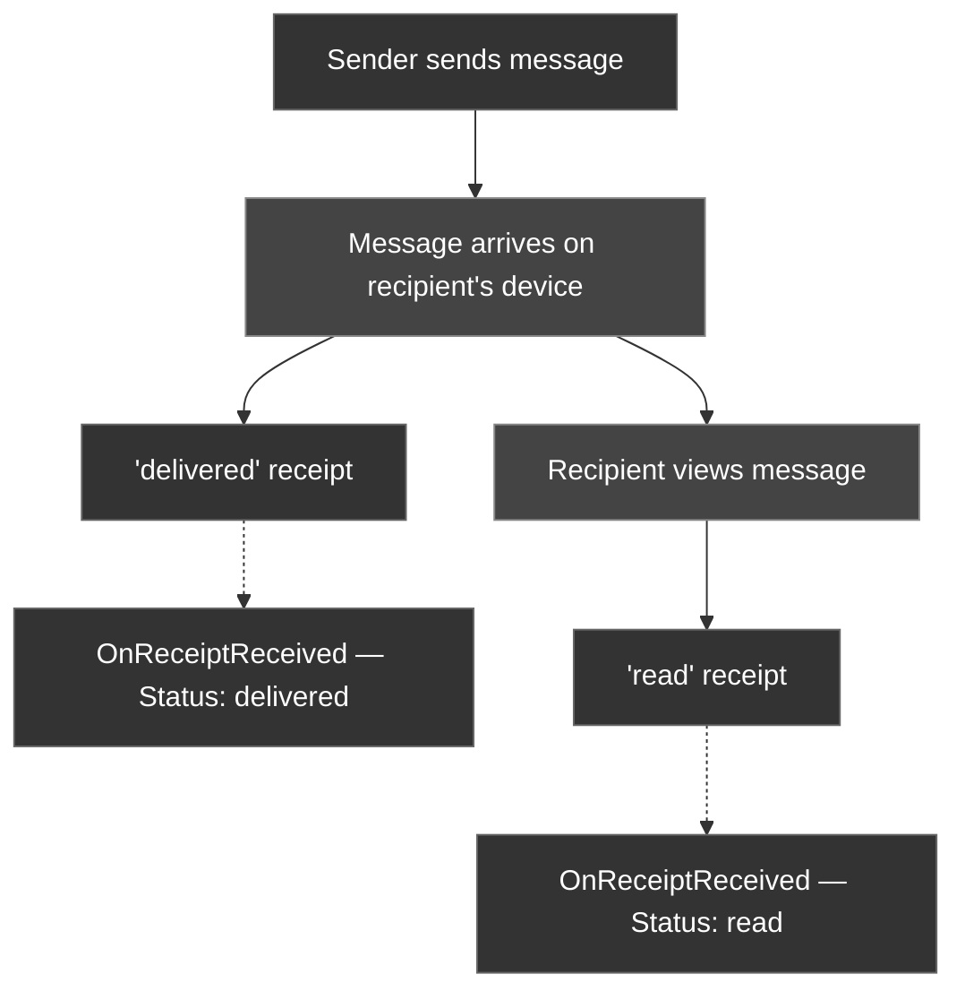

Delivery and read receipts let you show checkmark indicators (✓ delivered, ✓✓ read) next to messages in your chat UI. The CometChat Unreal SDK delivers these as real-time events through the `OnReceiptReceived` delegate.

---

## Listen for Receipt Events

Bind to the `OnReceiptReceived` delegate on the Subsystem.

<Tabs>
<Tab title="Blueprint">
1. Get a reference to the **CometChat Subsystem**
2. Drag off and search for **On Receipt Received**
3. Use **Bind Event** to connect it to a custom event
4. The custom event receives an `FCometChatReceiptEvent` parameter
</Tab>
<Tab title="C++">
```cpp
void AMyActor::BeginPlay()
{
    Super::BeginPlay();

    UCometChatSubsystem* Chat = GetGameInstance()->GetSubsystem<UCometChatSubsystem>();
    Chat->OnReceiptReceived.AddDynamic(this, &AMyActor::HandleReceipt);
}

void AMyActor::HandleReceipt(const FCometChatReceiptEvent& Event)
{
    if (Event.Status == TEXT("delivered"))
    {
        // Show single checkmark ✓
        MarkMessageDelivered(Event.MessageId);
    }
    else if (Event.Status == TEXT("read"))
    {
        // Show double checkmark ✓✓
        MarkMessageRead(Event.MessageId);
    }
}
```
</Tab>
</Tabs>

---

## FCometChatReceiptEvent

| Property | Type | Description |
| -------- | ---- | ----------- |
| `MessageId` | `FString` | The message this receipt applies to |
| `Uid` | `FString` | The user who triggered the receipt (the recipient) |
| `Status` | `FString` | `delivered` — message reached the device; `read` — message was viewed |
| `Timestamp` | `int64` | Unix timestamp when the receipt was generated |

---

## Receipt Flow



<Info>
A `read` receipt implies `delivered`. If you receive a `read` event for a message you haven't seen a `delivered` event for, treat it as both delivered and read.
</Info>

---

## Next Steps

<CardGroup cols={2}>
  <Card title="Connection Status" icon="wifi" href="/sdk/unreal/connection-status">
    Monitor the WebSocket connection state.
  </Card>
  <Card title="Real-Time Events" icon="bolt" href="/sdk/unreal/real-time-events">
    See all five delegates in one place.
  </Card>
</CardGroup>
