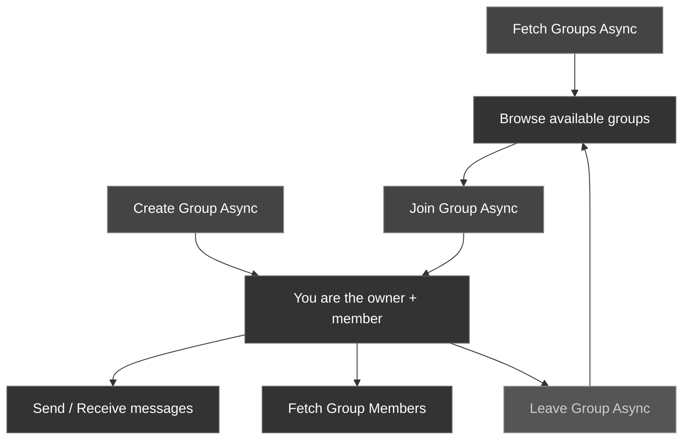

Groups let multiple users communicate in a shared conversation. The CometChat Unreal SDK provides async nodes for creating groups, joining existing ones, leaving, and sending/receiving group messages.

### Group Lifecycle



---

## Create a Group

Create a new group with a name and an initial set of member UIDs.

<Tabs>
<Tab title="Blueprint">
Call the **Create Group Async** node.

| Parameter | Type | Description |
| --------- | ---- | ----------- |
| Name | `FString` | Display name for the group |
| Member Ids | `TArray<FString>` | UIDs of users to add as initial members |

**On Success** returns an `FCometChatGroup` with the server-assigned `Guid`.
</Tab>
<Tab title="C++">
```cpp
#include "AsyncActions/CometChatCreateGroupAction.h"

void AMyActor::CreateLobbyGroup()
{
    TArray<FString> Members;
    Members.Add(TEXT("cometchat-uid-1"));
    Members.Add(TEXT("cometchat-uid-2"));
    Members.Add(TEXT("cometchat-uid-3"));

    auto* Action = UCometChatCreateGroupAction::CreateGroupAsync(
        this,
        TEXT("Game Lobby"),  // Group name
        Members              // Initial members
    );
    Action->OnSuccess.AddDynamic(this, &AMyActor::OnGroupCreated);
    Action->OnFailure.AddDynamic(this, &AMyActor::OnGroupCreateFailed);
    Action->Activate();
}

void AMyActor::OnGroupCreated(const FCometChatGroup& Group)
{
    UE_LOG(LogTemp, Log, TEXT("Group created: %s (GUID: %s)"),
        *Group.Name, *Group.Guid);
}

void AMyActor::OnGroupCreateFailed(const FString& Error)
{
    UE_LOG(LogTemp, Error, TEXT("Create group failed: %s"), *Error);
}
```
</Tab>
</Tabs>

---

## Join a Group

Join an existing group by its GUID.

<Tabs>
<Tab title="Blueprint">
<Frame>
  
</Frame>

Call the **Join Group Async** node.

| Parameter | Type | Description |
| --------- | ---- | ----------- |
| Guid | `FString` | The unique identifier of the group to join |

**On Success** fires with no output — the user is now a member.
</Tab>
<Tab title="C++">
```cpp
#include "AsyncActions/CometChatJoinGroupAction.h"

void AMyActor::JoinGroup(const FString& Guid)
{
    auto* Action = UCometChatJoinGroupAction::JoinGroupAsync(this, Guid);
    Action->OnSuccess.AddDynamic(this, &AMyActor::OnGroupJoined);
    Action->OnFailure.AddDynamic(this, &AMyActor::OnJoinFailed);
    Action->Activate();
}

void AMyActor::OnGroupJoined()
{
    UE_LOG(LogTemp, Log, TEXT("Successfully joined the group"));
}

void AMyActor::OnJoinFailed(const FString& Error)
{
    UE_LOG(LogTemp, Error, TEXT("Join failed: %s"), *Error);
}
```
</Tab>
</Tabs>

---

## Leave a Group

Leave a group you're currently a member of.

<Tabs>
<Tab title="Blueprint">
<Frame>
  
</Frame>

Call the **Leave Group Async** node.

| Parameter | Type | Description |
| --------- | ---- | ----------- |
| Guid | `FString` | The unique identifier of the group to leave |

**On Success** fires with no output.
</Tab>
<Tab title="C++">
```cpp
#include "AsyncActions/CometChatLeaveGroupAction.h"

void AMyActor::LeaveGroup(const FString& Guid)
{
    auto* Action = UCometChatLeaveGroupAction::LeaveGroupAsync(this, Guid);
    Action->OnSuccess.AddDynamic(this, &AMyActor::OnGroupLeft);
    Action->OnFailure.AddDynamic(this, &AMyActor::OnLeaveFailed);
    Action->Activate();
}

void AMyActor::OnGroupLeft()
{
    UE_LOG(LogTemp, Log, TEXT("Left the group"));
}

void AMyActor::OnLeaveFailed(const FString& Error)
{
    UE_LOG(LogTemp, Error, TEXT("Leave failed: %s"), *Error);
}
```
</Tab>
</Tabs>

---

## Fetch Groups

Retrieve a list of groups with optional search and filters.

<Tabs>
<Tab title="Blueprint">
<Frame>
  
</Frame>

Call the **Fetch Groups Async** node with an `FCometChatGroupsRequest` struct. Set `bJoinedOnly = true` to only fetch groups the user has joined, or leave it `false` to browse all available groups.
</Tab>
<Tab title="C++">
```cpp
#include "AsyncActions/CometChatFetchGroupsAction.h"

void AMyActor::FetchGroups()
{
    FCometChatGroupsRequest Request;
    Request.Limit = 20;
    Request.bJoinedOnly = true;

    auto* Action = UCometChatFetchGroupsAction::FetchGroups(this, Request);
    Action->OnSuccess.AddDynamic(this, &AMyActor::OnGroupsFetched);
    Action->OnFailure.AddDynamic(this, &AMyActor::OnFetchFailed);
    Action->Activate();
}
```
</Tab>
</Tabs>

---

## Send a Group Message

Send a text message to all members of a group. See [Send a Message → Group Messages](/sdk/unreal/send-message#send-a-group-message) for details.

---

## Fetch Group Message History

Retrieve previous messages from a group with pagination. See [Receive Messages → Group Messages](/sdk/unreal/receive-messages#fetch-group-messages) for details.

---

## FCometChatGroup Properties

| Property | Type | Description |
| -------- | ---- | ----------- |
| `Guid` | `FString` | Server-assigned unique group identifier |
| `Name` | `FString` | Group display name |
| `Description` | `FString` | Group description text |
| `MemberIds` | `TArray<FString>` | UIDs of current group members |

---

## Next Steps

<CardGroup cols={2}>
  <Card title="Send a Message" icon="paper-plane" href="/sdk/unreal/send-message">
    Send messages to users and groups.
  </Card>
  <Card title="Real-Time Events" icon="bolt" href="/sdk/unreal/real-time-events">
    Listen for messages, presence, typing, and more.
  </Card>
</CardGroup>
