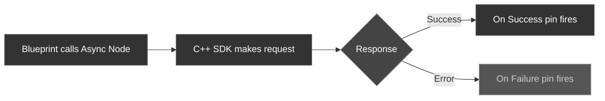

Before diving into individual features, it helps to understand the three building blocks of the plugin: the **Subsystem**, **Latent Async Nodes**, and **Real-Time Delegates**.

---

## The Subsystem

`UCometChatSubsystem` is a [UGameInstanceSubsystem](https://dev.epicgames.com/documentation/en-us/unreal-engine/programming-subsystems-in-unreal-engine) — Unreal creates one instance automatically when your game starts, and it lives for the entire session. You never need to spawn or manage it yourself.

<Tabs>
<Tab title="Blueprint">
Get a reference from any Blueprint:

**Get Game Instance** → **Get Subsystem** → select **CometChatSubsystem**
</Tab>
<Tab title="C++">
```cpp
UCometChatSubsystem* Chat = GetGameInstance()->GetSubsystem<UCometChatSubsystem>();
```
</Tab>
</Tabs>

The Subsystem handles:
- **Configuration** — storing your App ID and Region
- **SDK lifecycle** — creating and shutting down the underlying C++ SDK
- **Auth state** — tracking whether a user is logged in
- **Real-time events** — exposing multicast delegates for push notifications

---

## Latent Async Nodes

Every SDK operation that talks to the network (Login, Send Message, Get Messages, etc.) is exposed as a **latent async action** — a Blueprint node with two output execution pins:

| Pin | When it fires |
| --- | ------------- |
| **On Success** | The operation completed successfully. Output data is available on the success pin. |
| **On Failure** | Something went wrong. An `FString` error message describes what happened. |

### How an Async Node Executes



In C++, these are `UCometChatAsyncAction` subclasses. You create them with a static factory method, bind delegates, and call `Activate()`:

```cpp
auto* Action = UCometChatLoginAction::LoginAsync(this, TEXT("user-123"), TEXT("auth-key"));
Action->OnSuccess.AddDynamic(this, &AMyActor::HandleLoginSuccess);
Action->OnFailure.AddDynamic(this, &AMyActor::HandleLoginFailure);
Action->Activate();
```

<Info>
All async callbacks fire on the **Game Thread**, so it's safe to update UI, spawn actors, or call other engine APIs directly from the callback.
</Info>

### Available Async Nodes

| Category | Node | Success Output |
| -------- | ---- | -------------- |
| Auth | **Login Async** | — |
| Auth | **Logout Async** | — |
| Messaging | **Send Message Async** | `FCometChatMessage` |
| Messaging | **Send Group Message Async** | `FCometChatMessage` |
| Messaging | **Get Messages Async** | `TArray<FCometChatMessage>` |
| Messaging | **Get Group Messages Async** | `TArray<FCometChatMessage>` + `FCometChatPagination` |
| Users | **Get User Async** | `FCometChatUser` |
| Groups | **Create Group Async** | `FCometChatGroup` |
| Groups | **Join Group Async** | — |
| Groups | **Leave Group Async** | — |

---

## Real-Time Delegates

The Subsystem exposes five multicast delegates for real-time push events. Bind to them once after calling **Configure**, and they'll fire whenever the server pushes an update.

| Delegate | Payload Type | Fires When |
| -------- | ------------ | ---------- |
| `OnMessageReceived` | `FCometChatMessage` | A new message arrives in any conversation |
| `OnPresenceChanged` | `FCometChatPresence` | A user goes online, offline, or away |
| `OnTypingChanged` | `FCometChatTypingEvent` | A user starts or stops typing |
| `OnReceiptReceived` | `FCometChatReceiptEvent` | A message is delivered or read |
| `OnConnectionStateChanged` | `ECometChatConnectionState` | WebSocket connects, disconnects, or reconnects |

<Tabs>
<Tab title="Blueprint">
Drag off the Subsystem reference and search for the delegate name (e.g., **On Message Received**). Use **Bind Event** to wire it to a custom event.
</Tab>
<Tab title="C++">
```cpp
UCometChatSubsystem* Chat = GetGameInstance()->GetSubsystem<UCometChatSubsystem>();

Chat->OnMessageReceived.AddDynamic(this, &AMyActor::HandleNewMessage);
Chat->OnPresenceChanged.AddDynamic(this, &AMyActor::HandlePresence);
Chat->OnTypingChanged.AddDynamic(this, &AMyActor::HandleTyping);
Chat->OnReceiptReceived.AddDynamic(this, &AMyActor::HandleReceipt);
Chat->OnConnectionStateChanged.AddDynamic(this, &AMyActor::HandleConnection);
```
</Tab>
</Tabs>

<Warning>
Bind your delegates **before** calling Login. Events that arrive between Login and binding will be missed.
</Warning>

---

## Data Types

The plugin uses Unreal-native `USTRUCT` types — no `std::string` or STL containers leak into your game code.

### FCometChatUser

| Property | Type | Description |
| -------- | ---- | ----------- |
| `Uid` | `FString` | Unique user identifier |
| `Name` | `FString` | Display name |
| `AvatarUrl` | `FString` | URL to the user's avatar image |
| `Status` | `FString` | Current status text |

### FCometChatMessage

| Property | Type | Description |
| -------- | ---- | ----------- |
| `Id` | `FString` | Unique message identifier |
| `SenderUid` | `FString` | UID of the sender |
| `ReceiverUid` | `FString` | UID of the receiver (user or group) |
| `Text` | `FString` | Message body |
| `SentAt` | `int64` | Unix timestamp (seconds) when sent |
| `Type` | `FString` | Message type: `text`, `image`, `file`, `custom` |
| `Category` | `FString` | Category: `message`, `action`, `call`, `custom` |
| `ReceiverType` | `FString` | `user` or `group` |
| `ConversationId` | `FString` | Conversation identifier |
| `SenderName` | `FString` | Sender's display name |
| `SenderAvatar` | `FString` | Sender's avatar URL |
| `UpdatedAt` | `int64` | Unix timestamp of last update |

### FCometChatGroup

| Property | Type | Description |
| -------- | ---- | ----------- |
| `Guid` | `FString` | Unique group identifier |
| `Name` | `FString` | Group display name |
| `Description` | `FString` | Group description |
| `MemberIds` | `TArray<FString>` | UIDs of group members |

### FCometChatPagination

| Property | Type | Description |
| -------- | ---- | ----------- |
| `Total` | `int32` | Total messages available |
| `Count` | `int32` | Messages returned in this page |
| `PerPage` | `int32` | Page size requested |
| `CurrentPage` | `int32` | Current page number |
| `TotalPages` | `int32` | Total pages available |
| `HasMore` | `bool` | Whether more pages exist |
| `NextCursor` | `int32` | Message ID to pass as `BeforeMessageId` for the next page |

### FCometChatPresence

| Property | Type | Description |
| -------- | ---- | ----------- |
| `Uid` | `FString` | User identifier |
| `Status` | `ECometChatPresenceStatus` | `Online`, `Offline`, or `Away` |
| `LastActiveAt` | `int64` | Unix timestamp of last activity |

### FCometChatTypingEvent

| Property | Type | Description |
| -------- | ---- | ----------- |
| `Uid` | `FString` | User who is typing |
| `ConversationId` | `FString` | Conversation where typing is happening |
| `bIsTyping` | `bool` | `true` if started typing, `false` if stopped |

### FCometChatReceiptEvent

| Property | Type | Description |
| -------- | ---- | ----------- |
| `MessageId` | `FString` | The message this receipt is for |
| `Uid` | `FString` | User who triggered the receipt |
| `Status` | `FString` | `delivered` or `read` |
| `Timestamp` | `int64` | Unix timestamp of the receipt |

### Enums

**ECometChatConnectionState**

| Value | Description |
| ----- | ----------- |
| `Connected` | WebSocket is connected and active |
| `Disconnected` | WebSocket is disconnected |
| `Reconnecting` | SDK is attempting to reconnect |

**ECometChatPresenceStatus**

| Value | Description |
| ----- | ----------- |
| `Online` | User is currently online |
| `Offline` | User is offline |
| `Away` | User is away |
