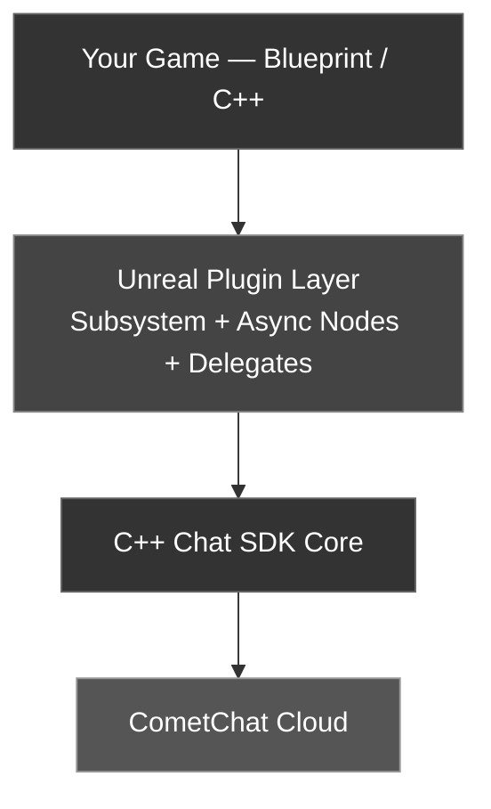
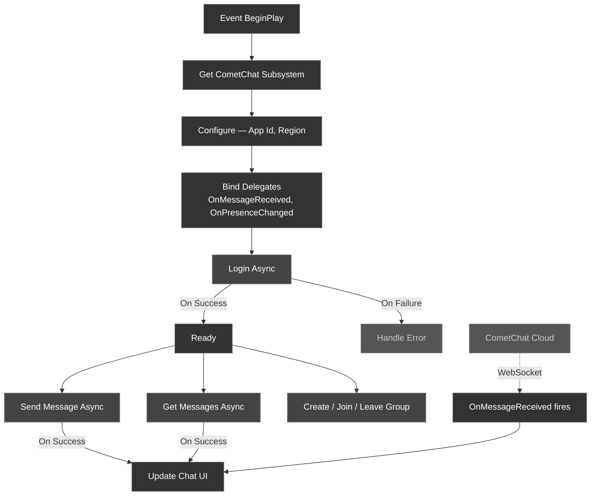

<Frame>
  
</Frame>

<Warning>
**Beta Release** — The CometChat Unreal SDK is currently in beta. APIs and features may change, and you may encounter stability issues.
</Warning>

This guide walks you through integrating CometChat into an Unreal Engine 5 project. The SDK ships as a native UE5 plugin with full **Blueprint** and **C++** support — so whether you're wiring up a quick prototype in the visual graph or building a production multiplayer title in code, you're covered.

<Tip>
Before you begin, we recommend reading the [Key Concepts](/sdk/unreal/key-concepts) page to understand the architecture.
</Tip>

---

## Supported Platforms

| Platform | Status |
| -------- | ------ |
| Windows (Win64) | ✅ Supported |
| macOS | ✅ Supported |
| iOS | ✅ Supported |
| Android | ✅ Supported |

---

## Minimum Requirements

- Unreal Engine **5.5.4** or **5.7.2**
- C++ development tools for your platform
- [CometChat account](https://app.cometchat.com) with **App ID**, **Region**, and **Auth Key**

---

## Quick Start

Get up and running in five steps:

<Steps>
  <Step title="Get your Application Keys">
    [Sign up for CometChat](https://app.cometchat.com), create a new app, and note your **App ID**, **Auth Key**, and **Region**.
  </Step>
  <Step title="Install the Plugin">
    Copy the `CometChat` plugin into your project's `Plugins/` directory. See [Setup](/sdk/unreal/setup) for details.
  </Step>
  <Step title="Configure the SDK">
    Call **Configure** on the `CometChatSubsystem` with your App ID and Region.
  </Step>
  <Step title="Log In">
    Use the **Login Async** node with a user UID and Auth Key.
  </Step>
  <Step title="Send a Message">
    Use the **Send Message Async** node to send your first message.
  </Step>
</Steps>

---

## Architecture

The plugin has three layers:

- **UCometChatSubsystem** — A `UGameInstanceSubsystem` that owns the SDK lifecycle. Access it from any Actor or Widget.
- **Latent Async Nodes** — Blueprint-friendly async actions with **Success** and **Failure** output pins.
- **Real-Time Delegates** — Multicast delegates on the Subsystem for push events. All fire on the **Game Thread**.

---

## How It Works in Blueprints

1. **Get the Subsystem** — `Get Game Instance` → `Get Subsystem` → `CometChatSubsystem`
2. **Configure** — Pass your App ID and Region once
3. **Bind Delegates** — Wire up `OnMessageReceived` and other events before Login
4. **Async Nodes** — Every operation has **On Success** and **On Failure** exec pins
5. **Real-Time Events** — Incoming messages and presence updates arrive automatically via delegates

<Info>
All callbacks fire on the **Game Thread** — safe to update UI directly.
</Info>

---

## What's Included

| Category | Capabilities |
| -------- | ------------ |
| **Authentication** | Login with Auth Key, Login with Auth Token, Logout, session check |
| **Messaging** | Send & receive text messages (1:1 and group), message history with pagination |
| **Users** | Fetch user profiles, real-time presence |
| **Groups** | Create, join, leave groups, group messaging |
| **Real-Time Events** | Message received, presence changed, typing indicators, read receipts, connection state |

---

## Sample Users

CometChat provides 5 pre-created users for testing:

| UID | Name |
| --- | ---- |
| `cometchat-uid-1` | Andrew Joseph |
| `cometchat-uid-2` | George Alan |
| `cometchat-uid-3` | Nancy Grace |
| `cometchat-uid-4` | Susan Marie |
| `cometchat-uid-5` | Peter Reed |

---

## Next Steps

<CardGroup cols={2}>
  <Card title="Setup" icon="wrench" href="/sdk/unreal/setup">
    Install the plugin and configure your project.
  </Card>
  <Card title="Key Concepts" icon="lightbulb" href="/sdk/unreal/key-concepts">
    Understand the Subsystem, async nodes, and event model.
  </Card>
  <Card title="Authentication" icon="lock" href="/sdk/unreal/authentication">
    Log users in and manage sessions.
  </Card>
  <Card title="Send a Message" icon="paper-plane" href="/sdk/unreal/send-message">
    Send your first text message.
  </Card>
</CardGroup>
