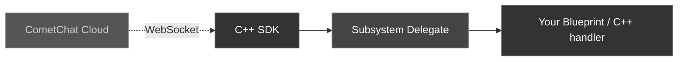

The `UCometChatSubsystem` exposes 40+ multicast delegates organized by listener type. All delegates fire on the **Game Thread**, so you can safely update UI directly.

### Event Flow



<Warning>
**Bind delegates before calling Login.** Events that arrive between Login completing and your bindings being set up will be missed.
</Warning>

---

## Binding Delegates

<Tabs>
<Tab title="Blueprint">
1. Get a reference to the **CometChat Subsystem**
2. Drag off the Subsystem pin and search for the delegate name (e.g., **On Text Message Received**)
3. Select **Bind Event** to wire it to a custom event node
4. The custom event automatically gets the correct parameter type
</Tab>
<Tab title="C++">
```cpp
void AMyActor::BeginPlay()
{
    Super::BeginPlay();

    UCometChatSubsystem* Chat = GetGameInstance()->GetSubsystem<UCometChatSubsystem>();

    // Message events
    Chat->OnTextMessageReceived.AddDynamic(this, &AMyActor::HandleTextMessage);
    Chat->OnTypingStarted.AddDynamic(this, &AMyActor::HandleTypingStarted);

    // User events
    Chat->OnUserOnline.AddDynamic(this, &AMyActor::HandleUserOnline);

    // Group events
    Chat->OnGroupMemberJoined.AddDynamic(this, &AMyActor::HandleMemberJoined);

    // Connection events
    Chat->OnConnected.AddDynamic(this, &AMyActor::HandleConnected);
    Chat->OnDisconnected.AddDynamic(this, &AMyActor::HandleDisconnected);
}
```
</Tab>
</Tabs>

---

## MessageListener Events

These fire when messages, typing indicators, receipts, or reactions arrive.

| Delegate | Payload | Fires When |
| -------- | ------- | ---------- |
| `OnTextMessageReceived` | `FCometChatMessage` | A text message arrives |
| `OnMediaMessageReceived` | `FCometChatMessage` | A media (image/video/audio/file) message arrives |
| `OnCustomMessageReceived` | `FCometChatMessage` | A custom message arrives |
| `OnInteractiveMessageReceived` | `FCometChatMessage` | An interactive message arrives |
| `OnInteractionGoalCompleted` | `FCometChatInteractionReceipt` | An interaction goal is completed |
| `OnTypingStarted` | `FCometChatTypingIndicator` | A user starts typing |
| `OnTypingEnded` | `FCometChatTypingIndicator` | A user stops typing |
| `OnMessagesDelivered` | `FCometChatMessageReceipt` | Messages delivered to recipient |
| `OnMessagesRead` | `FCometChatMessageReceipt` | Messages read by recipient |
| `OnMessagesDeliveredToAll` | `FCometChatMessageReceipt` | Messages delivered to all group members |
| `OnMessagesReadByAll` | `FCometChatMessageReceipt` | Messages read by all group members |
| `OnMessageEdited` | `FCometChatMessage` | A message is edited |
| `OnMessageDeleted` | `FCometChatMessage` | A message is deleted |
| `OnTransientMessageReceived` | `FCometChatTransientMessage` | A transient (ephemeral) message arrives |
| `OnMessageReactionAdded` | `FCometChatReactionEvent` | A reaction is added to a message |
| `OnMessageReactionRemoved` | `FCometChatReactionEvent` | A reaction is removed from a message |
| `OnMessageModerated` | `FCometChatMessage` | A message moderation status changes |
| `OnAIAssistantMessageReceived` | `FCometChatMessage` | An AI assistant message arrives |
| `OnAIToolResultReceived` | `FCometChatMessage` | An AI tool result arrives |
| `OnAIToolArgumentsReceived` | `FCometChatMessage` | AI tool arguments arrive |

<Tabs>
<Tab title="Blueprint">
Bind to **On Text Message Received**. The custom event receives an `FCometChatMessage`. Use `ReceiverType` to check if it's a `user` (1:1) or `group` message.
</Tab>
<Tab title="C++">
```cpp
void AMyActor::HandleTextMessage(const FCometChatMessage& Message)
{
    if (Message.ReceiverType == TEXT("group"))
    {
        UE_LOG(LogTemp, Log, TEXT("[Group %s] %s: %s"),
            *Message.ReceiverUid, *Message.SenderName, *Message.Text);
    }
    else
    {
        UE_LOG(LogTemp, Log, TEXT("[DM] %s: %s"),
            *Message.SenderName, *Message.Text);
    }
}
```
</Tab>
</Tabs>

---

## UserListener Events

These fire when a user's online status changes.

<Frame>
  
</Frame>

| Delegate | Payload | Fires When |
| -------- | ------- | ---------- |
| `OnUserOnline` | `FCometChatUser` | A user comes online |
| `OnUserOffline` | `FCometChatUser` | A user goes offline |

<Tabs>
<Tab title="Blueprint">
Bind to **On User Online** / **On User Offline**. The custom event receives an `FCometChatUser` with the user's full profile.
</Tab>
<Tab title="C++">
```cpp
void AMyActor::HandleUserOnline(const FCometChatUser& User)
{
    UE_LOG(LogTemp, Log, TEXT("%s is now online"), *User.Name);
}

void AMyActor::HandleUserOffline(const FCometChatUser& User)
{
    UE_LOG(LogTemp, Log, TEXT("%s went offline"), *User.Name);
}
```
</Tab>
</Tabs>

---

## GroupListener Events

These fire when group membership changes occur.

| Delegate | Payload | Fires When |
| -------- | ------- | ---------- |
| `OnGroupMemberJoined` | `FCometChatAction`, `FCometChatUser`, `FCometChatGroup` | A user joins a group |
| `OnGroupMemberLeft` | `FCometChatAction`, `FCometChatUser`, `FCometChatGroup` | A user leaves a group |
| `OnGroupMemberKicked` | `FCometChatAction`, `FCometChatUser`, `FCometChatUser`, `FCometChatGroup` | A member is kicked (includes who kicked) |
| `OnGroupMemberBanned` | `FCometChatAction`, `FCometChatUser`, `FCometChatUser`, `FCometChatGroup` | A member is banned (includes who banned) |
| `OnGroupMemberUnbanned` | `FCometChatAction`, `FCometChatUser`, `FCometChatUser`, `FCometChatGroup` | A member is unbanned |
| `OnGroupMemberScopeChanged` | `FCometChatScopeChangeEvent` | A member's role/scope changes |
| `OnMemberAddedToGroup` | `FCometChatAction`, `FCometChatUser`, `FCometChatUser`, `FCometChatGroup` | A member is added by another user |

<Tabs>
<Tab title="Blueprint">
Bind to **On Group Member Joined**. The custom event receives the action, the user who joined, and the group.
</Tab>
<Tab title="C++">
```cpp
void AMyActor::HandleMemberJoined(const FCometChatAction& Action,
    const FCometChatUser& JoinedUser, const FCometChatGroup& Group)
{
    UE_LOG(LogTemp, Log, TEXT("%s joined group %s"), *JoinedUser.Name, *Group.Name);
}
```
</Tab>
</Tabs>

---

## ConnectionListener Events

These fire when the WebSocket connection state changes.

| Delegate | Payload | Fires When |
| -------- | ------- | ---------- |
| `OnConnected` | — | WebSocket connection established |
| `OnConnecting` | — | SDK is attempting to connect |
| `OnDisconnected` | — | WebSocket connection lost |
| `OnFeatureThrottled` | — | A feature is being rate-limited |
| `OnConnectionError` | `FCometChatError` | A connection error occurred |

<Tabs>
<Tab title="Blueprint">
Bind to **On Connected**, **On Disconnected**, etc. These are parameterless events (except `OnConnectionError` which provides an `FCometChatError`).
</Tab>
<Tab title="C++">
```cpp
void AMyActor::HandleConnected()
{
    UE_LOG(LogTemp, Log, TEXT("Connected to CometChat"));
}

void AMyActor::HandleDisconnected()
{
    UE_LOG(LogTemp, Warning, TEXT("Disconnected from CometChat"));
}

void AMyActor::HandleConnectionError(const FCometChatError& Error)
{
    UE_LOG(LogTemp, Error, TEXT("Connection error: %s — %s"), *Error.Code, *Error.Message);
}
```
</Tab>
</Tabs>

---

## LoginListener Events

These fire on login/logout lifecycle events.

| Delegate | Payload | Fires When |
| -------- | ------- | ---------- |
| `OnLoginSuccess` | `FCometChatUser` | Login succeeds |
| `OnLoginFailure` | `FCometChatError` | Login fails |
| `OnLogoutSuccess` | — | Logout succeeds |
| `OnLogoutFailure` | `FCometChatError` | Logout fails |

<Tabs>
<Tab title="Blueprint">
Bind to **On Login Success** to receive the logged-in `FCometChatUser` after authentication completes.
</Tab>
<Tab title="C++">
```cpp
void AMyActor::HandleLoginSuccess(const FCometChatUser& User)
{
    UE_LOG(LogTemp, Log, TEXT("Logged in as %s (%s)"), *User.Name, *User.Uid);
}

void AMyActor::HandleLoginFailure(const FCometChatError& Error)
{
    UE_LOG(LogTemp, Error, TEXT("Login failed: %s"), *Error.Message);
}
```
</Tab>
</Tabs>

---

## AIAssistantListener Events

These fire when AI assistant interactions occur.

| Delegate | Payload | Fires When |
| -------- | ------- | ---------- |
| `OnAIAssistantEvent` | `FCometChatAIAssistantEvent` | An AI assistant event occurs |

<Tabs>
<Tab title="Blueprint">
Bind to **On AI Assistant Event**. The custom event receives an `FCometChatAIAssistantEvent` with event type, data, conversation ID, and sender UID.
</Tab>
<Tab title="C++">
```cpp
void AMyActor::HandleAIAssistantEvent(const FCometChatAIAssistantEvent& Event)
{
    UE_LOG(LogTemp, Log, TEXT("AI event [%s] in conversation %s: %s"),
        *Event.EventType, *Event.ConversationId, *Event.Data);
}
```
</Tab>
</Tabs>

---

## Error Handling — FCometChatError

Many delegates and failure callbacks provide an `FCometChatError` struct with details about what went wrong. Always handle errors gracefully in your game.

### FCometChatError

| Property | Type | Description |
| -------- | ---- | ----------- |
| `Code` | `FString` | Machine-readable error code (e.g., `"ERR_AUTH_FAILED"`, `"ERR_NETWORK"`) |
| `Message` | `FString` | Human-readable error description |
| `Details` | `FString` | Additional context (may be empty) |

### Handling Errors

<Tabs>
<Tab title="Blueprint">
All async nodes have an **On Failure** pin. Wire it to a custom event that receives an `FString` error message. Connection and login listener events provide the full `FCometChatError` struct.
</Tab>
<Tab title="C++">
```cpp
// Async node failure handler (simple string)
void AMyActor::HandleError(const FString& Error)
{
    UE_LOG(LogTemp, Error, TEXT("Operation failed: %s"), *Error);
    // Show error in UI, retry, or fallback
}

// Connection/Login listener error handler (full struct)
void AMyActor::HandleConnectionError(const FCometChatError& Error)
{
    UE_LOG(LogTemp, Error, TEXT("Error [%s]: %s — %s"),
        *Error.Code, *Error.Message, *Error.Details);

    // Common patterns:
    // - "ERR_NETWORK": Show "No internet" banner, retry with backoff
    // - "ERR_AUTH_FAILED": Redirect to login screen
    // - "ERR_RATE_LIMIT": Wait and retry after delay
}
```
</Tab>
</Tabs>

<Tip>
**Best practice**: Always bind `OnConnectionError` and `OnLoginFailure` delegates early. Network issues are common in games — show a reconnection banner rather than silently failing.
</Tip>

---

## Manual Connection

By default, the SDK auto-connects the WebSocket after login. For games with loading screens or lobbies where real-time events aren't needed immediately, you can manage the connection manually.

### Setup Manual Mode

Set `bAutoEstablishSocketConnection = false` in `FCometChatAppSettings` when configuring:

```cpp
FCometChatAppSettings Settings;
Settings.Region = TEXT("us");
Settings.bAutoEstablishSocketConnection = false;
Chat->ConfigureWithSettings(TEXT("YOUR_APP_ID"), Settings);
```

### Connect / Disconnect / Ping

<Tabs>
<Tab title="Blueprint">
- **Connect Async** — Establish the WebSocket after login
- **Disconnect Async** — Close the WebSocket (user stays authenticated)
- **Ping Async** — Verify the connection is alive
</Tab>
<Tab title="C++">
```cpp
// Connect when entering chat area
auto* Connect = UCometChatConnectAction::Connect(this);
Connect->OnSuccess.AddDynamic(this, &AMyActor::OnConnected);
Connect->OnFailure.AddDynamic(this, &AMyActor::HandleError);
Connect->Activate();

// Disconnect when leaving chat area
auto* Disconnect = UCometChatDisconnectAction::Disconnect(this);
Disconnect->OnSuccess.AddDynamic(this, &AMyActor::OnDisconnected);
Disconnect->Activate();

// Health check
auto* Ping = UCometChatPingAction::Ping(this);
Ping->OnSuccess.AddDynamic(this, &AMyActor::OnPingOk);
Ping->OnFailure.AddDynamic(this, &AMyActor::OnPingFailed);
Ping->Activate();
```
</Tab>
</Tabs>

### Query Connection State

```cpp
ECometChatConnectionState State = Chat->GetConnectionStatus();
// Connected, Connecting, Disconnected, or FeatureThrottled
```

<Info>
For full details on manual connection management, see [Advanced Configuration](/sdk/unreal/advanced-configuration).
</Info>

---

## Next Steps

<CardGroup cols={2}>
  <Card title="Typing Indicators" icon="keyboard" href="/sdk/unreal/typing-indicators">
    Send and receive typing state.
  </Card>
  <Card title="UI Components" icon="window-maximize" href="/sdk/unreal/ui-components">
    Drop-in chat panel and button widgets.
  </Card>
</CardGroup>
