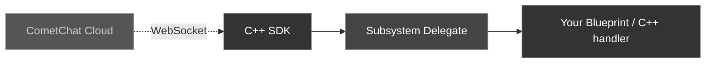

The `UCometChatSubsystem` exposes five multicast delegates that fire whenever the server pushes a real-time update. All delegates are guaranteed to fire on the **Game Thread**, so you can safely update UI directly.

### Event Flow



<Warning>
**Bind delegates before calling Login.** Events that arrive between Login completing and your bindings being set up will be missed.
</Warning>

---

## Binding Delegates

<Tabs>
<Tab title="Blueprint">
1. Get a reference to the **CometChat Subsystem**
2. Drag off the Subsystem pin and search for the delegate name (e.g., **On Message Received**)
3. Select **Bind Event** to wire it to a custom event node
4. The custom event automatically gets the correct parameter type
</Tab>
<Tab title="C++">
```cpp
void AMyActor::BeginPlay()
{
    Super::BeginPlay();

    UCometChatSubsystem* Chat = GetGameInstance()->GetSubsystem<UCometChatSubsystem>();

    Chat->OnMessageReceived.AddDynamic(this, &AMyActor::HandleMessage);
    Chat->OnPresenceChanged.AddDynamic(this, &AMyActor::HandlePresence);
    Chat->OnTypingChanged.AddDynamic(this, &AMyActor::HandleTyping);
    Chat->OnReceiptReceived.AddDynamic(this, &AMyActor::HandleReceipt);
    Chat->OnConnectionStateChanged.AddDynamic(this, &AMyActor::HandleConnection);
}
```
</Tab>
</Tabs>

---

## OnMessageReceived

Fires when a new message arrives in any conversation (1:1 or group).

| Payload | Type |
| ------- | ---- |
| `Message` | `FCometChatMessage` |

<Tabs>
<Tab title="Blueprint">
The custom event receives an `FCometChatMessage`. Use `ReceiverType` to check if it's a `user` (1:1) or `group` message, and `ConversationId` to route it to the right chat window.
</Tab>
<Tab title="C++">
```cpp
void AMyActor::HandleMessage(const FCometChatMessage& Message)
{
    if (Message.ReceiverType == TEXT("group"))
    {
        UE_LOG(LogTemp, Log, TEXT("[Group %s] %s: %s"),
            *Message.ConversationId, *Message.SenderName, *Message.Text);
    }
    else
    {
        UE_LOG(LogTemp, Log, TEXT("[DM] %s: %s"),
            *Message.SenderName, *Message.Text);
    }
}
```
</Tab>
</Tabs>

---

## OnPresenceChanged

Fires when a user's online status changes.

| Payload | Type |
| ------- | ---- |
| `Presence` | `FCometChatPresence` |

<Tabs>
<Tab title="Blueprint">
The custom event receives an `FCometChatPresence` with `Uid`, `Status` (an `ECometChatPresenceStatus` enum), and `LastActiveAt`.
</Tab>
<Tab title="C++">
```cpp
void AMyActor::HandlePresence(const FCometChatPresence& Presence)
{
    FString StatusStr;
    switch (Presence.Status)
    {
    case ECometChatPresenceStatus::Online:  StatusStr = TEXT("Online");  break;
    case ECometChatPresenceStatus::Offline: StatusStr = TEXT("Offline"); break;
    case ECometChatPresenceStatus::Away:    StatusStr = TEXT("Away");    break;
    }

    UE_LOG(LogTemp, Log, TEXT("%s is now %s"), *Presence.Uid, *StatusStr);
}
```
</Tab>
</Tabs>

For more details, see [Users → User Presence](/sdk/unreal/users#user-presence).

---

## OnTypingChanged

Fires when a user starts or stops typing in a conversation.

| Payload | Type |
| ------- | ---- |
| `Event` | `FCometChatTypingEvent` |

<Tabs>
<Tab title="Blueprint">
The custom event receives an `FCometChatTypingEvent` with `Uid`, `ConversationId`, and `bIsTyping`.
</Tab>
<Tab title="C++">
```cpp
void AMyActor::HandleTyping(const FCometChatTypingEvent& Event)
{
    if (Event.bIsTyping)
    {
        UE_LOG(LogTemp, Log, TEXT("%s is typing in %s..."),
            *Event.Uid, *Event.ConversationId);
    }
    else
    {
        UE_LOG(LogTemp, Log, TEXT("%s stopped typing in %s"),
            *Event.Uid, *Event.ConversationId);
    }
}
```
</Tab>
</Tabs>

For more details, see [Typing Indicators](/sdk/unreal/typing-indicators).

---

## OnReceiptReceived

Fires when a message is delivered to or read by the recipient.

| Payload | Type |
| ------- | ---- |
| `Event` | `FCometChatReceiptEvent` |

<Tabs>
<Tab title="Blueprint">
The custom event receives an `FCometChatReceiptEvent` with `MessageId`, `Uid`, `Status` (`delivered` or `read`), and `Timestamp`.
</Tab>
<Tab title="C++">
```cpp
void AMyActor::HandleReceipt(const FCometChatReceiptEvent& Event)
{
    UE_LOG(LogTemp, Log, TEXT("Message %s was %s by %s"),
        *Event.MessageId, *Event.Status, *Event.Uid);
}
```
</Tab>
</Tabs>

For more details, see [Delivery & Read Receipts](/sdk/unreal/delivery-read-receipts).

---

## OnConnectionStateChanged

Fires when the WebSocket connection state changes.

| Payload | Type |
| ------- | ---- |
| `State` | `ECometChatConnectionState` |

| Value | Meaning |
| ----- | ------- |
| `Connected` | WebSocket is active and receiving events |
| `Disconnected` | Connection lost |
| `Reconnecting` | SDK is attempting to reconnect automatically |

<Tabs>
<Tab title="Blueprint">
The custom event receives an `ECometChatConnectionState` enum value.
</Tab>
<Tab title="C++">
```cpp
void AMyActor::HandleConnection(ECometChatConnectionState State)
{
    switch (State)
    {
    case ECometChatConnectionState::Connected:
        UE_LOG(LogTemp, Log, TEXT("Connected to CometChat"));
        break;
    case ECometChatConnectionState::Disconnected:
        UE_LOG(LogTemp, Warning, TEXT("Disconnected from CometChat"));
        break;
    case ECometChatConnectionState::Reconnecting:
        UE_LOG(LogTemp, Warning, TEXT("Reconnecting..."));
        break;
    }
}
```
</Tab>
</Tabs>

For more details, see [Connection Status](/sdk/unreal/connection-status).

---

## Delegate Summary

| Delegate | Payload | Use Case |
| -------- | ------- | -------- |
| `OnMessageReceived` | `FCometChatMessage` | Display new messages in chat UI |
| `OnPresenceChanged` | `FCometChatPresence` | Update online/offline indicators |
| `OnTypingChanged` | `FCometChatTypingEvent` | Show "typing..." animations |
| `OnReceiptReceived` | `FCometChatReceiptEvent` | Show delivery/read checkmarks |
| `OnConnectionStateChanged` | `ECometChatConnectionState` | Show connection status banners |
