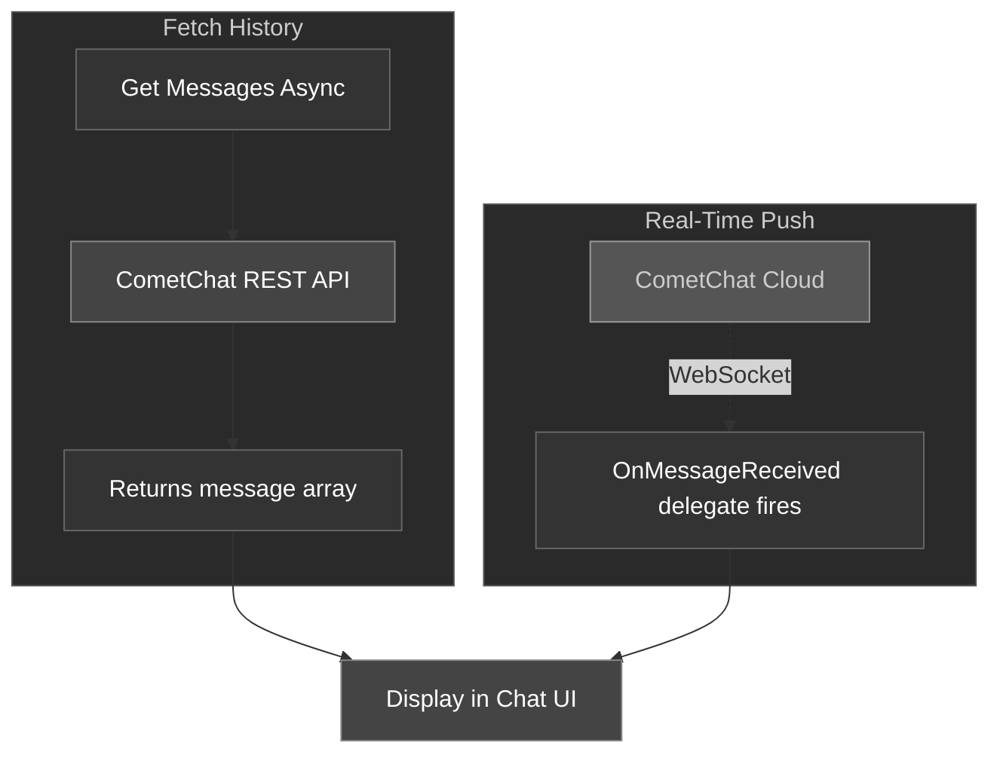

There are two ways to get messages in the CometChat Unreal SDK:

1. **Fetch history** — pull previous messages for a conversation using async nodes
2. **Real-time push** — listen for new messages as they arrive via the `OnMessageReceived` delegate

### How Messages Flow



---

## Fetch User Messages

Retrieve the message history for a 1:1 conversation.

<Tabs>
<Tab title="Blueprint">
Call the **Get Messages Async** node.

| Parameter | Type | Description |
| --------- | ---- | ----------- |
| Uid | `FString` | The UID of the other user in the conversation |
| Limit | `int32` | Maximum number of messages to return (default: 50) |

**On Success** returns a `TArray<FCometChatMessage>` — an array of messages sorted by timestamp.
</Tab>
<Tab title="C++">
```cpp
#include "AsyncActions/CometChatGetMessagesAction.h"

void AMyActor::FetchMessages()
{
    auto* Action = UCometChatGetMessagesAction::GetMessagesAsync(
        this,
        TEXT("cometchat-uid-2"),  // Other user's UID
        30                        // Limit
    );
    Action->OnSuccess.AddDynamic(this, &AMyActor::OnMessagesFetched);
    Action->OnFailure.AddDynamic(this, &AMyActor::OnFetchFailed);
    Action->Activate();
}

void AMyActor::OnMessagesFetched(const TArray<FCometChatMessage>& Messages)
{
    for (const FCometChatMessage& Msg : Messages)
    {
        UE_LOG(LogTemp, Log, TEXT("[%s]: %s"), *Msg.SenderName, *Msg.Text);
    }
}

void AMyActor::OnFetchFailed(const FString& Error)
{
    UE_LOG(LogTemp, Error, TEXT("Fetch failed: %s"), *Error);
}
```
</Tab>
</Tabs>

---

## Fetch Group Messages

Retrieve the message history for a group conversation, with pagination support.

<Tabs>
<Tab title="Blueprint">
Call the **Get Group Messages Async** node.

| Parameter | Type | Description |
| --------- | ---- | ----------- |
| Guid | `FString` | The group's unique identifier |
| Limit | `int32` | Maximum messages per page (default: 50) |
| Before Message Id | `int32` | Pass `0` for the first page. For subsequent pages, pass the `NextCursor` value from the previous response's `FCometChatPagination`. |

**On Success** returns two outputs:
- `TArray<FCometChatMessage>` — the messages for this page
- `FCometChatPagination` — pagination metadata including `HasMore` and `NextCursor`
</Tab>
<Tab title="C++">
```cpp
#include "AsyncActions/CometChatGetGroupMessagesAction.h"

void AMyActor::FetchGroupMessages(int32 BeforeId)
{
    auto* Action = UCometChatGetGroupMessagesAction::GetGroupMessagesAsync(
        this,
        TEXT("group-abc-123"),  // Group GUID
        20,                     // Limit
        BeforeId                // 0 for first page
    );
    Action->OnSuccess.AddDynamic(this, &AMyActor::OnGroupMessagesFetched);
    Action->OnFailure.AddDynamic(this, &AMyActor::OnGroupFetchFailed);
    Action->Activate();
}

void AMyActor::OnGroupMessagesFetched(
    const TArray<FCometChatMessage>& Messages,
    const FCometChatPagination& Pagination)
{
    for (const FCometChatMessage& Msg : Messages)
    {
        UE_LOG(LogTemp, Log, TEXT("[%s]: %s"), *Msg.SenderName, *Msg.Text);
    }

    if (Pagination.HasMore)
    {
        // Load next page
        FetchGroupMessages(Pagination.NextCursor);
    }
}
```
</Tab>
</Tabs>

### Pagination

The `FCometChatPagination` struct tells you where you are in the message history:

| Property | Type | Description |
| -------- | ---- | ----------- |
| `Total` | `int32` | Total messages available in the conversation |
| `Count` | `int32` | Messages returned in this page |
| `PerPage` | `int32` | Page size that was requested |
| `HasMore` | `bool` | `true` if there are older messages to fetch |
| `NextCursor` | `int32` | Pass this as `BeforeMessageId` to get the next page |

<Tip>
**Infinite scroll pattern**: Start with `BeforeMessageId = 0`, then keep passing `NextCursor` from each response until `HasMore` is `false`.
</Tip>

---

## Real-Time: Incoming Messages

To receive messages as they arrive (without polling), bind to the `OnMessageReceived` delegate on the Subsystem.

<Tabs>
<Tab title="Blueprint">
1. Get a reference to the **CometChat Subsystem**
2. Drag off and search for **On Message Received**
3. Use **Bind Event** to connect it to a custom event
4. The custom event receives an `FCometChatMessage` parameter

Bind this **before** calling Login so you don't miss any messages.
</Tab>
<Tab title="C++">
```cpp
void AMyActor::BeginPlay()
{
    Super::BeginPlay();

    UCometChatSubsystem* Chat = GetGameInstance()->GetSubsystem<UCometChatSubsystem>();
    Chat->OnMessageReceived.AddDynamic(this, &AMyActor::HandleNewMessage);
}

void AMyActor::HandleNewMessage(const FCometChatMessage& Message)
{
    // This fires on the Game Thread — safe to update UI
    UE_LOG(LogTemp, Log, TEXT("New message from %s: %s"),
        *Message.SenderName, *Message.Text);

    // Check if it's a group or user message
    if (Message.ReceiverType == TEXT("group"))
    {
        // Group message — Message.ReceiverUid is the group GUID
    }
    else
    {
        // 1:1 message — Message.SenderUid is the other user
    }
}
```
</Tab>
</Tabs>

<Info>
The `OnMessageReceived` delegate fires for **all** conversations — both 1:1 and group. Use `ReceiverType` to distinguish between them, and `ConversationId` to route messages to the right chat window.
</Info>

---

## Next Steps

<CardGroup cols={2}>
  <Card title="Users" icon="user" href="/sdk/unreal/users">
    Fetch user profiles and track presence.
  </Card>
  <Card title="Groups" icon="users" href="/sdk/unreal/groups">
    Create, join, and leave groups.
  </Card>
  <Card title="Real-Time Events" icon="bolt" href="/sdk/unreal/real-time-events">
    All five real-time delegates explained in detail.
  </Card>
</CardGroup>
