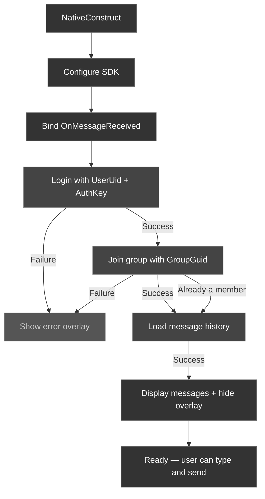

The CometChat plugin ships with a ready-to-use **Group Chat Box** widget (`UCometChatGroupChatBox`) that handles the entire chat flow out of the box: configure, login, join group, load history, send messages, and receive messages in real time.

It's designed as a starting point — use it as-is for quick integration, or as a reference for building your own custom chat UI.

### What It Does

```mermaid
flowchart LR
    A["Drop widget into viewport"] --> B["Auto-configures SDK"]
    B --> C["Logs in user"]
    C --> D["Joins group"]
    D --> E["Loads message history"]
    E --> F["Ready — send & receive"]

    style A fill:#333,stroke:#666,color:#fff
    style B fill:#333,stroke:#666,color:#fff
    style C fill:#333,stroke:#666,color:#fff
    style D fill:#444,stroke:#888,color:#fff
    style E fill:#444,stroke:#888,color:#fff
    style F fill:#333,stroke:#666,color:#fff
```



---

## Quick Start

### Blueprint

1. Create a new **Widget Blueprint** (or open an existing HUD widget)
2. In the Palette, search for **CometChat Group Chat Box**
3. Drag it onto your canvas
4. In the **Details** panel, fill in the config properties:

| Property | Value |
| -------- | ----- |
| **App Id** | Your CometChat App ID |
| **Region** | `us` or `eu` |
| **Auth Key** | Your CometChat Auth Key |
| **User Uid** | The UID of the player to log in as |
| **Group Guid** | The GUID of the group to join |

5. Play — the widget handles everything automatically

### C++

```cpp
#include "UI/CometChatGroupChatBox.h"

void AMyHUD::BeginPlay()
{
    Super::BeginPlay();

    UCometChatGroupChatBox* ChatBox = CreateWidget<UCometChatGroupChatBox>(
        GetOwningPlayerController(),
        UCometChatGroupChatBox::StaticClass()
    );

    ChatBox->AppId = TEXT("YOUR_APP_ID");
    ChatBox->Region = TEXT("us");
    ChatBox->AuthKey = TEXT("YOUR_AUTH_KEY");
    ChatBox->UserUid = TEXT("cometchat-uid-1");
    ChatBox->GroupGuid = TEXT("your-group-guid");

    ChatBox->AddToViewport(10);
}
```

---

## How It Works

When the widget is constructed, it runs an automatic flow:



The widget shows a loading overlay during each step ("Configuring...", "Logging in...", "Joining group...", "Loading messages...") and transitions to the chat view once ready.

---

## Widget Structure

The widget builds its entire UI programmatically in C++ — no Blueprint designer layout needed.

```
UCometChatGroupChatBox
├── SizeBox (PanelWidth x PanelHeight)
│   └── Overlay
│       ├── Border (rounded panel background)
│       │   └── VerticalBox
│       │       ├── ScrollBox (message list, fills available space)
│       │       │   └── Message rows (added dynamically)
│       │       └── HorizontalBox (composer row)
│       │           ├── Border (rounded input background)
│       │           │   └── EditableTextBox (message input)
│       │           ├── Button (send button, circular)
│       │           └── Button (options button, optional)
│       └── Border (loading overlay, hidden when ready)
│           └── TextBlock (status text)
```

Each message row contains:
- **Avatar** — circular with initial letter, loads actual image from URL asynchronously
- **Online indicator** — green dot on the avatar
- **Username** — colored differently for self vs others
- **Message text** — white, auto-wrapping
- **Timestamp** — gray, right-aligned (HH:MM format)

---

## Customization

Every visual aspect is exposed as a `UPROPERTY` — editable in the Blueprint Details panel or settable in C++.

### Panel

| Property | Type | Default | Description |
| -------- | ---- | ------- | ----------- |
| `PanelWidth` | `float` | `520` | Widget width in pixels |
| `PanelHeight` | `float` | `300` | Widget height in pixels |
| `PanelBackgroundColor` | `FLinearColor` | `(0, 0, 0, 0.35)` | Panel background with alpha |
| `PanelCornerRadius` | `float` | `12` | Rounded corner radius |
| `PanelPadding` | `float` | `12` | Inner padding |
| `MessageLimit` | `int32` | `30` | Messages to load from history |

### Messages

| Property | Type | Default | Description |
| -------- | ---- | ------- | ----------- |
| `SenderNameColor` | `FLinearColor` | Yellow | Your username color |
| `ReceiverNameColor` | `FLinearColor` | Blue | Other users' name color |
| `MessageTextColor` | `FLinearColor` | White (0.9 alpha) | Message body color |
| `UsernameFontSize` | `float` | `15` | Username text size |
| `MessageFontSize` | `float` | `15` | Message body text size |
| `MessageSpacing` | `float` | `6` | Vertical gap between messages |
| `bEnableTextShadow` | `bool` | `true` | Drop shadow on text |

### Avatars

| Property | Type | Default | Description |
| -------- | ---- | ------- | ----------- |
| `bShowAvatars` | `bool` | `true` | Show circular avatars |
| `AvatarSize` | `float` | `36` | Avatar diameter in pixels |
| `AvatarPlaceholderColor` | `FLinearColor` | Gray | Background when no image |
| `bShowOnlineIndicator` | `bool` | `true` | Green dot on avatar |
| `OnlineIndicatorColor` | `FLinearColor` | Green | Indicator dot color |

### Composer

| Property | Type | Default | Description |
| -------- | ---- | ------- | ----------- |
| `ComposerBackgroundColor` | `FLinearColor` | Dark gray | Input field background |
| `ComposerCornerRadius` | `float` | `20` | Input field corner radius |
| `ComposerPlaceholderText` | `FString` | `"Type a message..."` | Placeholder text |

### Send Button

| Property | Type | Default | Description |
| -------- | ---- | ------- | ----------- |
| `SendButtonLabel` | `FString` | `">"` | Button text |
| `SendButtonColor` | `FLinearColor` | Blue | Button background |
| `SendButtonWidth` | `float` | `42` | Button size (square) |
| `SendButtonCornerRadius` | `float` | `20` | Makes it circular |

### Options Button

| Property | Type | Default | Description |
| -------- | ---- | ------- | ----------- |
| `bShowOptionsButton` | `bool` | `true` | Show the "..." button |
| `OptionsButtonLabel` | `FString` | `"..."` | Button text |

### Timestamps

| Property | Type | Default | Description |
| -------- | ---- | ------- | ----------- |
| `bShowTimestamp` | `bool` | `true` | Show HH:MM timestamps |
| `TimestampColor` | `FLinearColor` | Gray | Timestamp text color |
| `TimestampFontSize` | `float` | `11` | Timestamp text size |

---

## Events

The widget exposes one event dispatcher:

| Event | Description |
| ----- | ----------- |
| `OnOptionsClicked` | Fires when the user clicks the options ("...") button. Bind this to show a custom menu (e.g., leave group, mute, settings). |

<Tabs>
<Tab title="Blueprint">
In the Details panel, find **On Options Clicked** under Events and click the **+** to bind it.
</Tab>
<Tab title="C++">
```cpp
ChatBox->OnOptionsClicked.AddDynamic(this, &AMyHUD::HandleChatOptions);
```
</Tab>
</Tabs>

---

## Real-Time Messages

The widget automatically binds to `OnMessageReceived` on the `UCometChatSubsystem`. When a new group message arrives:

1. It checks if the message belongs to the configured `GroupGuid`
2. It filters out messages sent by the current user (to avoid duplicates — sent messages are already added on send)
3. It creates a new message row and scrolls to the bottom

No additional wiring needed.

---

## Loading States

The widget shows an overlay with status text during each phase:

| State | Overlay Text |
| ----- | ------------ |
| Configuring | "Configuring..." |
| Logging In | "Logging in..." |
| Joining Group | "Joining group..." |
| Loading History | "Loading messages..." |
| Ready | Overlay hidden |
| Error | Error message displayed |

The overlay background color and text style are customizable via the `Overlay` properties.

---

## Next Steps

<CardGroup cols={2}>
  <Card title="Setup" icon="wrench" href="/sdk/unreal/setup">
    Install the plugin in your project.
  </Card>
  <Card title="Key Concepts" icon="lightbulb" href="/sdk/unreal/key-concepts">
    Understand the Subsystem and async node patterns for building custom UI.
  </Card>
</CardGroup>
