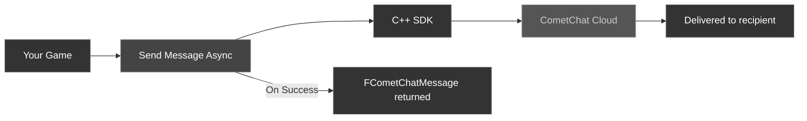

Once a user is [logged in](/sdk/unreal/authentication), you can send text messages to other users (1:1) or to groups.

### Message Flow



---

## Send a User Message

Send a text message to a specific user by their UID.

<Tabs>
<Tab title="Blueprint">
1. Get a reference to the **CometChat Subsystem**
2. Call the **Send Message Async** node
3. Wire the **On Success** and **On Failure** pins

| Parameter | Type | Description |
| --------- | ---- | ----------- |
| Receiver Uid | `FString` | The UID of the user to send the message to |
| Text | `FString` | The message body |

**On Success** returns an `FCometChatMessage` with the sent message details (including the server-assigned `Id` and `SentAt` timestamp).
</Tab>
<Tab title="C++">
```cpp
#include "AsyncActions/CometChatSendMessageAction.h"

void AMyActor::SendDirectMessage()
{
    auto* Action = UCometChatSendMessageAction::SendMessageAsync(
        this,
        TEXT("cometchat-uid-2"),   // Receiver UID
        TEXT("Hey, want to play?") // Message text
    );
    Action->OnSuccess.AddDynamic(this, &AMyActor::OnMessageSent);
    Action->OnFailure.AddDynamic(this, &AMyActor::OnMessageFailed);
    Action->Activate();
}

void AMyActor::OnMessageSent(const FCometChatMessage& Message)
{
    UE_LOG(LogTemp, Log, TEXT("Message sent! ID: %s"), *Message.Id);
}

void AMyActor::OnMessageFailed(const FString& Error)
{
    UE_LOG(LogTemp, Error, TEXT("Send failed: %s"), *Error);
}
```
</Tab>
</Tabs>

---

## Send a Group Message

Send a text message to a group by its GUID.

<Tabs>
<Tab title="Blueprint">
Call the **Send Group Message Async** node.

| Parameter | Type | Description |
| --------- | ---- | ----------- |
| Guid | `FString` | The unique identifier of the target group |
| Text | `FString` | The message body |

**On Success** returns an `FCometChatMessage`.
</Tab>
<Tab title="C++">
```cpp
#include "AsyncActions/CometChatSendGroupMessageAction.h"

void AMyActor::SendToGroup()
{
    auto* Action = UCometChatSendGroupMessageAction::SendGroupMessageAsync(
        this,
        TEXT("group-abc-123"),       // Group GUID
        TEXT("Team, ready up!")      // Message text
    );
    Action->OnSuccess.AddDynamic(this, &AMyActor::OnGroupMessageSent);
    Action->OnFailure.AddDynamic(this, &AMyActor::OnGroupMessageFailed);
    Action->Activate();
}

void AMyActor::OnGroupMessageSent(const FCometChatMessage& Message)
{
    UE_LOG(LogTemp, Log, TEXT("Group message sent! ID: %s"), *Message.Id);
}

void AMyActor::OnGroupMessageFailed(const FString& Error)
{
    UE_LOG(LogTemp, Error, TEXT("Group send failed: %s"), *Error);
}
```
</Tab>
</Tabs>

---

## The FCometChatMessage Struct

Both send operations return an `FCometChatMessage` on success. Here's a quick reference of the key fields:

| Property | Type | Description |
| -------- | ---- | ----------- |
| `Id` | `FString` | Server-assigned unique message ID |
| `SenderUid` | `FString` | UID of the sender (the logged-in user) |
| `ReceiverUid` | `FString` | UID of the receiver (user UID or group GUID) |
| `Text` | `FString` | The message body |
| `SentAt` | `int64` | Unix timestamp when the message was sent |
| `Type` | `FString` | `text` for text messages |
| `ReceiverType` | `FString` | `user` for 1:1, `group` for group messages |
| `ConversationId` | `FString` | Unique conversation identifier |

For the full struct definition, see [Key Concepts → FCometChatMessage](/sdk/unreal/key-concepts#fchatmessage).

---

## Next Steps

<CardGroup cols={2}>
  <Card title="Receive Messages" icon="inbox" href="/sdk/unreal/receive-messages">
    Fetch message history and listen for incoming messages in real time.
  </Card>
  <Card title="Groups" icon="users" href="/sdk/unreal/groups">
    Create and manage groups before sending group messages.
  </Card>
</CardGroup>
