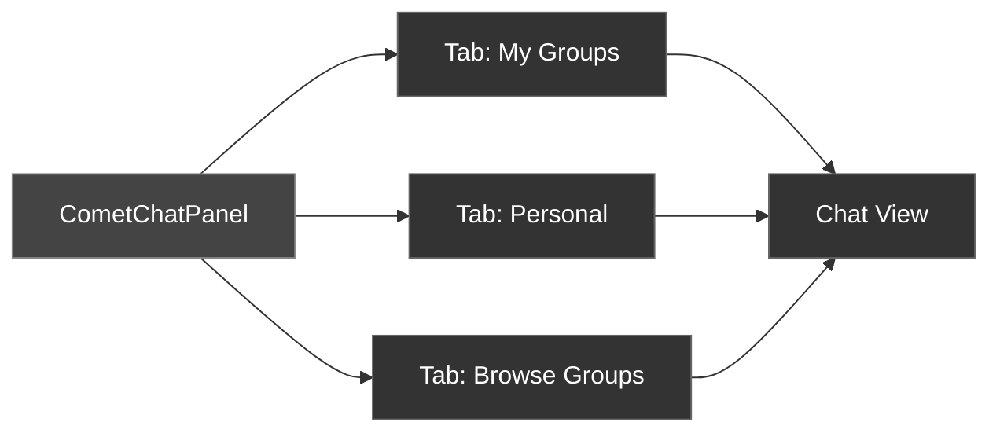
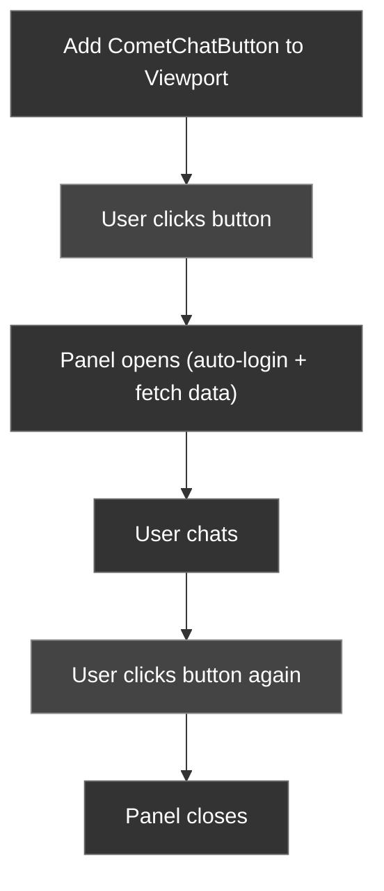

The CometChat Unreal SDK includes two ready-to-use UMG widgets that provide a complete chat experience out of the box. Both are fully styleable and configurable via Blueprint properties.

---

## UCometChatPanel

A game-style tabbed chat panel with a dark translucent HUD aesthetic. It provides:

- **Three tabs**: My Groups, Personal, Browse Groups
- **Search**: Filter conversations and groups by name
- **Inline chat view**: Select a conversation to open the chat within the panel
- **Typing indicators**: Shows who is typing in the active chat
- **Avatar loading**: Async avatar image loading with fallback initials
- **Message filters**: Configurable filters for message types and categories



### Adding to Viewport

<Tabs>
<Tab title="Blueprint">
1. Create a Widget Blueprint with parent class **CometChat Panel**
2. Set the **App Id**, **Region**, **Auth Key**, and **User Uid** properties
3. Add to viewport via **Create Widget** → **Add to Viewport**

Or use the `UCometChatButton` widget which manages the panel automatically.
</Tab>
<Tab title="C++">
```cpp
void AMyHUD::BeginPlay()
{
    Super::BeginPlay();

    UCometChatPanel* Panel = CreateWidget<UCometChatPanel>(GetWorld());
    Panel->AppId = TEXT("YOUR_APP_ID");
    Panel->Region = TEXT("us");
    Panel->AuthKey = TEXT("YOUR_AUTH_KEY");
    Panel->UserUid = TEXT("cometchat-uid-1");
    Panel->AddToViewport();
}
```
</Tab>
</Tabs>

### Configuration Properties

#### SDK Config

| Property | Type | Default | Description |
| -------- | ---- | ------- | ----------- |
| `AppId` | `FString` | — | Your CometChat App ID |
| `Region` | `FString` | `"us"` | App region (`us` or `eu`) |
| `AuthKey` | `FString` | — | Your CometChat Auth Key |
| `UserUid` | `FString` | — | UID of the user to log in as |

#### Panel Style

| Property | Type | Default | Description |
| -------- | ---- | ------- | ----------- |
| `PanelWidth` | `float` | `650` | Panel width in pixels |
| `PanelHeight` | `float` | `450` | Panel height in pixels |
| `PanelBackground` | `FLinearColor` | Dark translucent | Background color |
| `AccentColor` | `FLinearColor` | Blue | Primary accent color |
| `TabActiveColor` | `FLinearColor` | Blue | Active tab color |
| `TabInactiveColor` | `FLinearColor` | Dark gray | Inactive tab color |
| `TextColor` | `FLinearColor` | Light gray | Primary text color |
| `SubTextColor` | `FLinearColor` | Medium gray | Secondary text color |
| `FontSize` | `float` | `12` | Base font size |
| `SmallFontSize` | `float` | `10` | Small text font size |
| `CornerRadius` | `float` | `8` | Border corner radius |
| `SidebarWidth` | `float` | `220` | Sidebar/list width |

#### Message Style

| Property | Type | Default | Description |
| -------- | ---- | ------- | ----------- |
| `ChatMessageFontSize` | `float` | `10` | Message text size |
| `ChatAvatarSize` | `float` | `24` | Avatar image size |
| `ChatUsernameOwnColor` | `FLinearColor` | Blue | Own username color |
| `ChatUsernameOtherColor` | `FLinearColor` | Gold | Other username color |

#### Message Filters

| Property | Type | Default | Description |
| -------- | ---- | ------- | ----------- |
| `bShowTextMessages` | `bool` | `true` | Show text messages |
| `bShowImageMessages` | `bool` | `true` | Show image messages |
| `bShowVideoMessages` | `bool` | `true` | Show video messages |
| `bShowAudioMessages` | `bool` | `true` | Show audio messages |
| `bShowFileMessages` | `bool` | `true` | Show file messages |
| `bShowCustomMessages` | `bool` | `true` | Show custom messages |
| `bShowActionMessages` | `bool` | `false` | Show action messages (join/leave) |
| `bShowCallMessages` | `bool` | `false` | Show call messages |
| `bHideBlockedUserMessages` | `bool` | `false` | Hide messages from blocked users |
| `bHideDeletedMessages` | `bool` | `true` | Hide deleted messages |
| `bHideReplies` | `bool` | `true` | Hide thread replies from main chat |
| `bOnlyWithAttachments` | `bool` | `false` | Only show messages with attachments |
| `bOnlyWithMentions` | `bool` | `false` | Only show messages with mentions |
| `bOnlyWithReactions` | `bool` | `false` | Only show messages with reactions |
| `bOnlyUnread` | `bool` | `false` | Only show unread messages |

---

## UCometChatButton

A floating circular button that toggles the `UCometChatPanel` open and closed. Add it to your HUD for a one-click chat experience.

### Adding to Viewport

<Tabs>
<Tab title="Blueprint">
1. Create a Widget Blueprint with parent class **CometChat Button**
2. Set the **App Id**, **Region**, **Auth Key**, and **User Uid** properties
3. Add to viewport — the button appears as a floating circle
4. Clicking the button opens/closes the full chat panel
</Tab>
<Tab title="C++">
```cpp
void AMyHUD::BeginPlay()
{
    Super::BeginPlay();

    UCometChatButton* ChatButton = CreateWidget<UCometChatButton>(GetWorld());
    ChatButton->AppId = TEXT("YOUR_APP_ID");
    ChatButton->Region = TEXT("us");
    ChatButton->AuthKey = TEXT("YOUR_AUTH_KEY");
    ChatButton->UserUid = TEXT("cometchat-uid-1");
    ChatButton->AddToViewport();
}
```
</Tab>
</Tabs>

### Configuration Properties

| Property | Type | Default | Description |
| -------- | ---- | ------- | ----------- |
| `AppId` | `FString` | — | Your CometChat App ID |
| `Region` | `FString` | `"us"` | App region |
| `AuthKey` | `FString` | — | Your CometChat Auth Key |
| `UserUid` | `FString` | — | UID of the user to log in as |
| `ButtonSize` | `float` | `56` | Button diameter in pixels |
| `ButtonColor` | `FLinearColor` | Blue | Button background color |
| `ButtonHoverColor` | `FLinearColor` | Light blue | Button hover color |
| `IconColor` | `FLinearColor` | White | Icon/text color |
| `IconFontSize` | `float` | `20` | Icon font size |

### Blueprint Methods

| Method | Returns | Description |
| ------ | ------- | ----------- |
| `ToggleChatPanel()` | `void` | Open or close the chat panel programmatically |
| `IsPanelOpen()` | `bool` | Check if the panel is currently visible |

---

## Usage Pattern

The typical setup is to add `UCometChatButton` to your HUD. It handles creating and managing the `UCometChatPanel` internally:



<Info>
The panel handles SDK initialization, login, and data fetching automatically when opened. You only need to provide the configuration properties.
</Info>

---

## Next Steps

<CardGroup cols={2}>
  <Card title="Setup" icon="wrench" href="/sdk/unreal/setup">
    Install the plugin and configure your project.
  </Card>
  <Card title="Advanced Configuration" icon="gear" href="/sdk/unreal/advanced-configuration">
    Fine-tune SDK settings and connection management.
  </Card>
</CardGroup>
