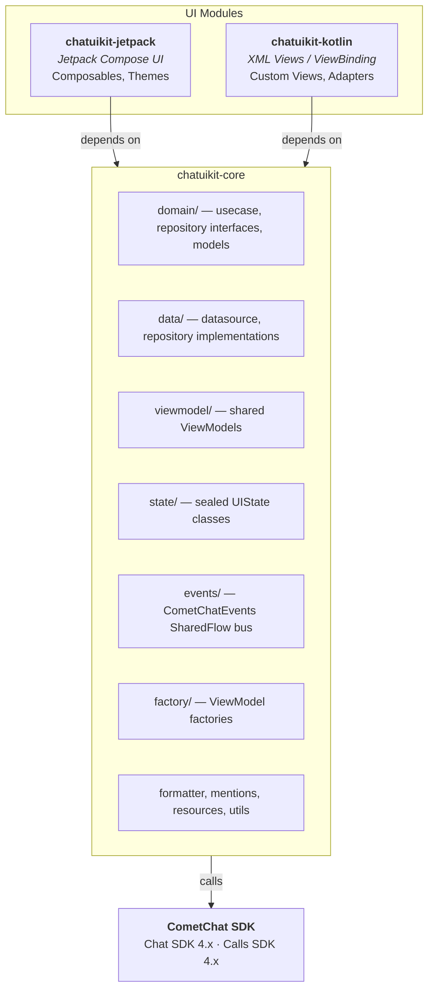
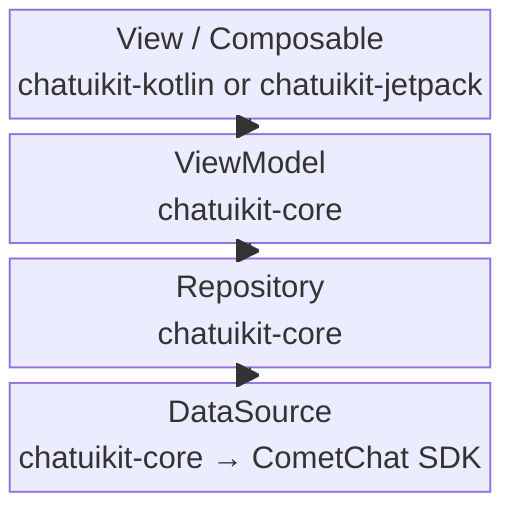
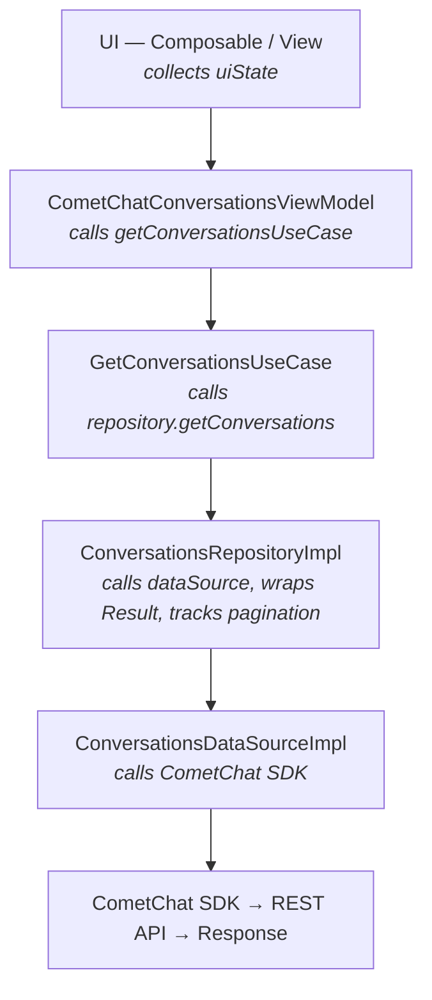
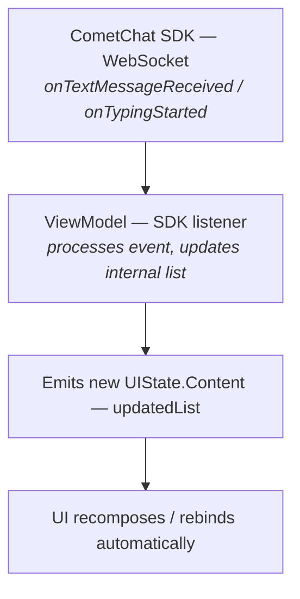
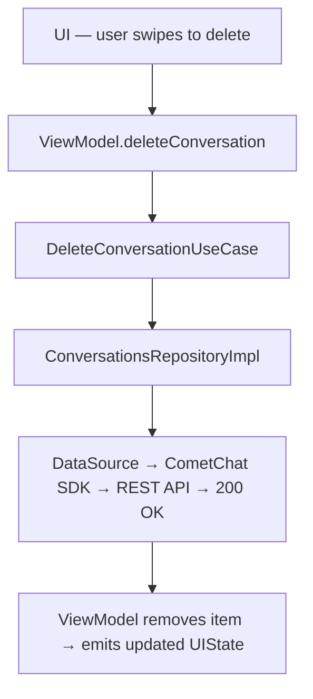
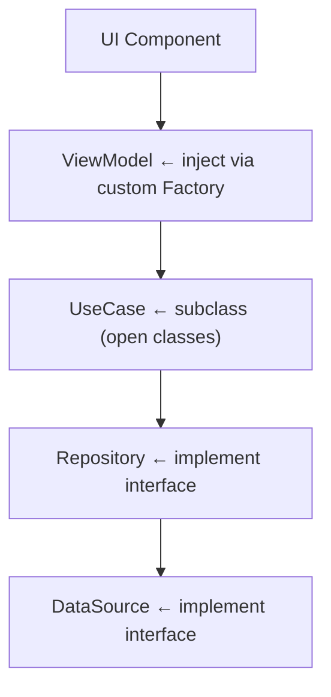

The UI Kit is split into three modules that follow Clean Architecture principles. `chatuikit-core` holds all business logic, data access, and state management. The UI modules (`chatuikit-jetpack` and `chatuikit-kotlin`) provide platform-specific rendering on top of the shared core.

## Module Structure



## 4-Layer Architecture

Every feature follows the same layered flow: **View → ViewModel → Repository → DataSource**.



The ViewModel lives in `chatuikit-core` and is shared by both UI modules. This means the same `CometChatConversationsViewModel` drives both the XML View and the Composable — only the rendering layer differs.

## Clean Architecture Layers (chatuikit-core)

### Data Layer

The data layer wraps the CometChat SDK behind interfaces, making it swappable and testable.

**DataSource** — defines the contract for raw SDK operations:

```kotlin
// Interface (contract)
interface ConversationsDataSource {
    suspend fun fetchConversations(request: ConversationsRequest): List<Conversation>
    suspend fun deleteConversation(conversationWith: String, conversationType: String): String
    suspend fun markAsDelivered(message: BaseMessage)
}

// Implementation (calls CometChat SDK)
class ConversationsDataSourceImpl : ConversationsDataSource {
    override suspend fun fetchConversations(request: ConversationsRequest): List<Conversation> {
        // Wraps CometChat.fetchConversations() in a coroutine
    }
}
```

Every feature has a DataSource pair: `ConversationsDataSource` / `ConversationsDataSourceImpl`, `UsersDataSource` / `UsersDataSourceImpl`, etc.

**Repository Implementation** — coordinates data sources and handles error wrapping:

```kotlin
class ConversationsRepositoryImpl(
    private val dataSource: ConversationsDataSource
) : ConversationsRepository {

    private var hasMore = true

    override suspend fun getConversations(
        request: ConversationsRequest
    ): Result<List<Conversation>> {
        return try {
            val conversations = dataSource.fetchConversations(request)
            hasMore = conversations.isNotEmpty()
            Result.success(conversations)
        } catch (e: CometChatException) {
            Result.failure(e)
        }
    }
}
```

Repositories wrap raw SDK exceptions into Kotlin `Result` types, track pagination state, and coordinate between data sources.

### Domain Layer

The domain layer defines contracts and single-purpose use cases. It has no dependency on the SDK or Android framework.

**Repository Interfaces** — contracts that the data layer implements:

```kotlin
interface ConversationsRepository {
    suspend fun getConversations(request: ConversationsRequest): Result<List<Conversation>>
    suspend fun deleteConversation(conversationWith: String, conversationType: String): Result<Unit>
    suspend fun markAsDelivered(conversation: Conversation): Result<Unit>
    fun hasMoreConversations(): Boolean
}
```

**Use Cases** — encapsulate a single business action:

```kotlin
open class GetConversationsUseCase(
    private val repository: ConversationsRepository
) {
    open suspend operator fun invoke(
        request: ConversationsRequest
    ): Result<List<Conversation>> {
        return repository.getConversations(request)
    }

    open fun hasMore(): Boolean = repository.hasMoreConversations()
}
```

Use cases are `open` so they can be overridden for testing or custom behavior. Each use case does one thing:

| Use Case | Action |
|---|---|
| `GetConversationsUseCase` | Fetch paginated conversations |
| `DeleteConversationUseCase` | Delete a conversation |
| `RefreshConversationsUseCase` | Clear and re-fetch |
| `FetchUsersUseCase` / `SearchUsersUseCase` | Fetch or search users |
| `FetchGroupsUseCase` | Fetch groups |
| `FetchGroupMembersUseCase` / `SearchGroupMembersUseCase` | Fetch or search group members |
| `BanGroupMemberUseCase` / `KickGroupMemberUseCase` | Member moderation |
| `ChangeMemberScopeUseCase` | Change member role |
| `SendTextMessageUseCase` / `SendMediaMessageUseCase` / `SendCustomMessageUseCase` | Send messages |
| `EditMessageUseCase` | Edit a sent message |
| `FetchCallLogsUseCase` | Fetch call history |
| `InitiateCallUseCase` / `InitiateUserCallUseCase` / `StartGroupCallUseCase` | Start calls |
| `FetchReactionsUseCase` / `RemoveReactionUseCase` | Reaction management |
| `CreatePollUseCase` | Create a poll |
| `GetStickersUseCase` | Fetch sticker sets |
| `JoinGroupUseCase` / `GetGroupUseCase` / `GetUserUseCase` | Entity lookups |

### ViewModel Layer

ViewModels receive use cases via constructor injection and expose `StateFlow` / sealed `UIState` classes to the UI:

```kotlin
class CometChatConversationsViewModel(
    private val getConversationsUseCase: GetConversationsUseCase,
    private val deleteConversationUseCase: DeleteConversationUseCase,
    private val refreshConversationsUseCase: RefreshConversationsUseCase,
    private val enableListeners: Boolean = true
) : ViewModel() {

    // UI observes this sealed state
    private val _uiState = MutableStateFlow<UIState>(UIState.Loading)
    val uiState: StateFlow<UIState> = _uiState

    fun fetchConversations() {
        viewModelScope.launch {
            getConversationsUseCase(request)
                .onSuccess { conversations ->
                    _uiState.value = if (conversations.isEmpty()) UIState.Empty
                                     else UIState.Content(conversations)
                }
                .onFailure { _uiState.value = UIState.Error(it) }
        }
    }
}
```

### State Management (StateFlow + Sealed Classes)

Each feature has a dedicated sealed UIState class. All state is exposed via `StateFlow` — not LiveData:

```kotlin
sealed class UIState {
    object Loading : UIState()
    object Empty : UIState()
    data class Error(val exception: CometChatException) : UIState()
    data class Content(val conversations: List<Conversation>) : UIState()
}
```

Feature-specific states include additional fields:

| State Class | Feature | Extra Fields |
|---|---|---|
| `ConversationStarterUIState` | Conversation list | — |
| `MessageListUIState` | Message list | scroll position, reply state |
| `MessageComposerUIState` | Composer | attachment state, edit mode |
| `MessageHeaderUIState` | Header | typing indicator, user status |
| `GroupsUIState` | Groups | — |
| `UsersUIState` | Users | — |
| `GroupMembersUIState` | Group members | scope change state |
| `CallLogsUIState` | Call logs | — |
| `CallButtonsUIState` | Call buttons | call initiation state |
| `IncomingCallUIState` / `OutgoingCallUIState` / `OngoingCallUIState` | Calls | call session state |
| `ReactionListUIState` | Reactions | — |
| `CreatePollUIState` | Polls | form validation state |
| `StickerKeyboardUIState` | Stickers | sticker sets |

### ListOperations Interface

List-based ViewModels implement the `ListOperations` interface, which provides a standard contract for manipulating list data:

```kotlin
interface ListOperations<T> {
    fun addAtIndex(index: Int, item: T)
    fun updateAtIndex(index: Int, item: T)
    fun removeAtIndex(index: Int)
    fun moveToTop(item: T)
}
```

This ensures consistent list manipulation across Conversations, Users, Groups, Group Members, and Call Logs.

## Dependency Injection via Factories

ViewModels are created through `ViewModelProvider.Factory` classes that wire up the dependency chain:

```kotlin
class CometChatConversationsViewModelFactory(
    private val repository: ConversationsRepository = ConversationsRepositoryImpl(
        ConversationsDataSourceImpl()
    ),
    private val enableListeners: Boolean = true
) : ViewModelProvider.Factory {

    override fun <T : ViewModel> create(modelClass: Class<T>): T {
        val getUseCase = GetConversationsUseCase(repository)
        val deleteUseCase = DeleteConversationUseCase(repository)
        val refreshUseCase = RefreshConversationsUseCase(repository)

        return CometChatConversationsViewModel(
            getConversationsUseCase = getUseCase,
            deleteConversationUseCase = deleteUseCase,
            refreshConversationsUseCase = refreshUseCase,
            enableListeners = enableListeners
        ) as T
    }
}
```

Default implementations are provided, but you can inject custom repositories:

```kotlin
// Custom repository for testing or caching
val factory = CometChatConversationsViewModelFactory(
    repository = MyCustomConversationRepository(),
    enableListeners = false  // disable for previews
)
```

## Data Flow: End to End

### Fetching Conversations



### Real-Time Updates



### User Action (Delete Conversation)



## Component ↔ Core Mapping

| UI Component | Core ViewModel | Use Cases | Repository | DataSource |
|---|---|---|---|---|
| Conversation List | `CometChatConversationsViewModel` | Get, Delete, Refresh | `ConversationsRepository` | `ConversationsDataSource` |
| Message List | `CometChatMessageListViewModel` | (message fetching) | `MessageListRepository` | `MessageListDataSource` |
| Message Composer | `CometChatMessageComposerViewModel` | SendText, SendMedia, SendCustom, Edit | `MessageComposerRepository` | `MessageComposerDataSource` |
| Message Header | `CometChatMessageHeaderViewModel` | — | `MessageHeaderRepository` | `MessageHeaderDataSource` |
| Users | `CometChatUsersViewModel` | FetchUsers, SearchUsers | `UsersRepository` | `UsersDataSource` |
| Groups | `CometChatGroupsViewModel` | FetchGroups, JoinGroup | `GroupsRepository` | `GroupsDataSource` |
| Group Members | `CometChatGroupMembersViewModel` | FetchMembers, Search, Ban, Kick, ChangeScope | `GroupMembersRepository` | `GroupMembersDataSource` |
| Call Logs | `CometChatCallLogsViewModel` | FetchCallLogs | `CallLogsRepository` | `CallLogsDataSource` |
| Call Buttons | `CometChatCallButtonsViewModel` | InitiateCall, StartGroupCall | `CallButtonsRepository` | `CallButtonsDataSource` |
| Reactions | `CometChatReactionListViewModel` | FetchReactions, RemoveReaction | `ReactionListRepository` | `ReactionListDataSource` |
| Message Info | `CometChatMessageInformationViewModel` | — | `MessageInformationRepository` | `MessageInformationDataSource` |

## Events (Cross-Component Communication)

The `CometChatEvents` singleton in `chatuikit-core` provides a typed event bus using Kotlin `SharedFlow` for communication between components that don't share a ViewModel:

| Event Flow | Emitted When |
|---|---|
| `CometChatEvents.messageEvents` | Message sent, edited, deleted, reacted |
| `CometChatEvents.conversationEvents` | Conversation deleted |
| `CometChatEvents.groupEvents` | Group created, member added/removed/banned |
| `CometChatEvents.userEvents` | User blocked/unblocked |
| `CometChatEvents.callEvents` | Call initiated, accepted, rejected |
| `CometChatEvents.uiEvents` | UI-level events (show dialog, navigate) |

See the [Events reference](/ui-kit/android/v6/events) for sealed class types and subscription examples.

## Component-Level Overrides

Every layer in the architecture is designed to be replaceable. You can override at the level that makes sense for your use case — from swapping the entire data source to just tweaking a single use case.

### Override Points



### 1. Custom Repository

The most common override. Implement the repository interface and pass it to the factory.

```kotlin
class OfflineUsersRepository : UsersRepository {

    private val cachedUsers = listOf(/* local data */)

    override suspend fun getUsers(request: UsersRequest): Result<List<User>> {
        return Result.success(cachedUsers)
    }

    override fun hasMoreUsers(): Boolean = false
}
```

Wire it in:

<Tabs>
<Tab title="Kotlin (XML Views)">
```kotlin
val factory = CometChatUsersViewModelFactory(
    repository = OfflineUsersRepository(),
    enableListeners = false
)
val viewModel = ViewModelProvider(this, factory)[CometChatUsersViewModel::class.java]

val usersView = findViewById<CometChatUsers>(R.id.users)
usersView.setViewModel(viewModel)
```
</Tab>

<Tab title="Jetpack Compose">
```kotlin
val factory = CometChatUsersViewModelFactory(
    repository = OfflineUsersRepository(),
    enableListeners = false
)
val viewModel: CometChatUsersViewModel = viewModel(factory = factory)

CometChatUsers(
    usersViewModel = viewModel
)
```
</Tab>
</Tabs>

### 2. Custom DataSource

Override at the lowest level to change how SDK calls are made — useful for caching, offline support, or wrapping a different backend.

```kotlin
class CachedUsersDataSource(
    private val sdkDataSource: UsersDataSourceImpl = UsersDataSourceImpl(),
    private val cache: UserCache
) : UsersDataSource {

    override suspend fun fetchUsers(request: UsersRequest): List<User> {
        val cached = cache.get(request)
        if (cached != null) return cached

        val users = sdkDataSource.fetchUsers(request)
        cache.put(request, users)
        return users
    }
}
```

Then wrap it in the default repository implementation:

```kotlin
val dataSource = CachedUsersDataSource(cache = myCache)
val repository = UsersRepositoryImpl(dataSource)
val factory = CometChatUsersViewModelFactory(repository = repository)
```

### 3. Custom Use Cases

Use cases are `open` classes, so you can subclass them to add validation, logging, or transformation:

```kotlin
class LoggingGetConversationsUseCase(
    repository: ConversationsRepository
) : GetConversationsUseCase(repository) {

    override suspend operator fun invoke(
        request: ConversationsRequest
    ): Result<List<Conversation>> {
        Log.d("Conversations", "Fetching conversations...")
        val result = super.invoke(request)
        result.onSuccess { Log.d("Conversations", "Fetched ${it.size} items") }
        result.onFailure { Log.e("Conversations", "Fetch failed", it) }
        return result
    }
}
```

### 4. Passing a Custom ViewModel to the UI Component

Both `chatuikit-jetpack` (Compose) and `chatuikit-kotlin` (XML Views) accept a pre-built ViewModel. This is the entry point for all overrides.

<Tabs>
<Tab title="Kotlin (XML Views)">
```kotlin
class MyUsersActivity : AppCompatActivity() {
    override fun onCreate(savedInstanceState: Bundle?) {
        super.onCreate(savedInstanceState)
        setContentView(R.layout.activity_users)

        val factory = CometChatUsersViewModelFactory(
            repository = MyCustomUsersRepository()
        )
        val viewModel = ViewModelProvider(this, factory)[CometChatUsersViewModel::class.java]

        val usersView = findViewById<CometChatUsers>(R.id.users)
        usersView.setViewModel(viewModel)
    }
}
```
</Tab>

<Tab title="Jetpack Compose">
```kotlin
@Composable
fun MyUsersScreen() {
    val factory = CometChatUsersViewModelFactory(
        repository = MyCustomUsersRepository(),
        enableListeners = true
    )
    val viewModel: CometChatUsersViewModel = viewModel(factory = factory)

    CometChatUsers(
        usersViewModel = viewModel,
        style = CometChatUsersStyle.default(),
        hideToolbar = false,
        hideSearchBox = false
    )
}
```
</Tab>
</Tabs>

### 5. Disabling Listeners for Previews and Testing

Every factory accepts `enableListeners = false`. When disabled, the ViewModel won't register SDK listeners or UIKit event subscriptions — useful for Compose previews, unit tests, or showcase screens:

```kotlin
val factory = CometChatConversationsViewModelFactory(
    repository = FakeConversationRepository(),
    enableListeners = false  // No WebSocket listeners, no event subscriptions
)
```

### Override Summary by Component

| Component | Factory Class | Repository Interface | Key Use Cases |
|---|---|---|---|
| Conversation List | `CometChatConversationsViewModelFactory` | `ConversationsRepository` | Get, Delete, Refresh |
| Users | `CometChatUsersViewModelFactory` | `UsersRepository` | FetchUsers, SearchUsers |
| Groups | `CometChatGroupsViewModelFactory` | `GroupsRepository` | FetchGroups, JoinGroup |
| Group Members | `CometChatGroupMembersViewModelFactory` | `GroupMembersRepository` | FetchMembers, Search, Ban, Kick, ChangeScope |
| Message List | `CometChatMessageListViewModelFactory` | `MessageListRepository` | (message fetching) |
| Message Composer | `CometChatMessageComposerViewModelFactory` | `MessageComposerRepository` | SendText, SendMedia, SendCustom, Edit |
| Call Logs | `CometChatCallLogsViewModelFactory` | `CallLogsRepository` | FetchCallLogs |
| Call Buttons | `CometChatCallButtonsViewModelFactory` | `CallButtonsRepository` | InitiateCall, StartGroupCall |
| Reactions | `CometChatReactionListViewModelFactory` | `ReactionListRepository` | FetchReactions, RemoveReaction |

## Related

- [Events](/ui-kit/android/v6/events) — Cross-component communication via `CometChatEvents` SharedFlow
- [Methods](/ui-kit/android/v6/methods) — UI Kit wrapper methods for init, auth, and messaging
