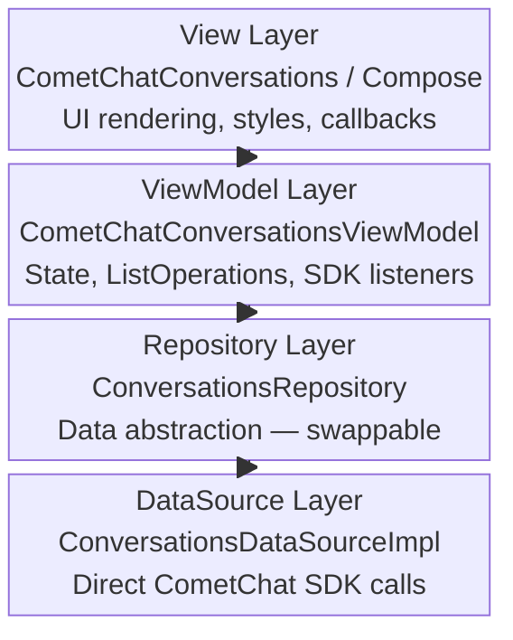

Every component in the UI Kit follows a layered architecture. Understanding these layers is the key to deep customization without rebuilding components from scratch.

---

## Architecture Layers

Each component is built from four layers, from outermost (UI) to innermost (data):

| Layer | Role | Example |
| --- | --- | --- |
| View | Renders UI, handles user interaction, exposes setter methods | `CometChatConversations`, `CometChatMessageList` |
| ViewModel | Manages state, business logic, list operations, and SDK listeners | `CometChatConversationsViewModel`, `CometChatMessageListViewModel` |
| Repository | Abstracts data fetching — can be swapped for custom implementations | `ConversationsRepository`, `MessageListRepository` |
| DataSource | Direct SDK calls — the lowest layer that talks to CometChat servers | `ConversationsDataSourceImpl`, `MessageListDataSourceImpl` |



The ViewModel lives in `chatuikit-core` and is shared by both Kotlin XML Views and Jetpack Compose. The View layer is module-specific.

---

## Overriding the ViewModel

Every component accepts an external ViewModel. This lets you subclass the default ViewModel to override behavior, or provide a completely custom one.

<Tabs>
<Tab title="Kotlin (XML Views)">

```kotlin lines
// 1. Subclass the ViewModel to override behavior
class MyConversationsViewModel(
    getConversationsUseCase: GetConversationsUseCase,
    deleteConversationUseCase: DeleteConversationUseCase,
    refreshConversationsUseCase: RefreshConversationsUseCase
) : CometChatConversationsViewModel(
    getConversationsUseCase,
    deleteConversationUseCase,
    refreshConversationsUseCase
) {
    // Override any behavior here
}

// 2. Create a factory with optional custom repository
val factory = CometChatConversationsViewModelFactory(
    repository = MyCustomRepository() // or use default
)

// 3. Create the ViewModel via ViewModelProvider
val viewModel = ViewModelProvider(this, factory)
    .get(MyConversationsViewModel::class.java)

// 4. Inject into the component
val conversations = findViewById<CometChatConversations>(R.id.conversations)
conversations.setViewModel(viewModel)
```

</Tab>
<Tab title="Jetpack Compose">

```kotlin lines
// 1. Subclass the ViewModel to override behavior
class MyConversationsViewModel(
    getConversationsUseCase: GetConversationsUseCase,
    deleteConversationUseCase: DeleteConversationUseCase,
    refreshConversationsUseCase: RefreshConversationsUseCase
) : CometChatConversationsViewModel(
    getConversationsUseCase,
    deleteConversationUseCase,
    refreshConversationsUseCase
) {
    // Override any behavior here
}

// 2. Create a factory with optional custom repository
val factory = CometChatConversationsViewModelFactory(
    repository = MyCustomRepository() // or use default
)

// 3. Create and pass to the component
val viewModel: MyConversationsViewModel = viewModel(factory = factory)

CometChatConversations(
    conversationsViewModel = viewModel
)
```

</Tab>
</Tabs>

---

## Overriding the Repository

Each ViewModel is created via a Factory that accepts a custom Repository. Implement the repository interface to change how data is fetched.

```kotlin lines
// 1. Implement the repository interface
class MyConversationsRepository : ConversationsRepository {
    override suspend fun fetchConversations(request: ConversationsRequest): List<Conversation> {
        // Custom data fetching logic — local DB, filtered API call, etc.
    }
    // ... implement other methods
}

// 2. Create a factory with your custom repository
val factory = CometChatConversationsViewModelFactory(
    repository = MyConversationsRepository()
)

// 3. Create the ViewModel using the factory
val viewModel = ViewModelProvider(this, factory)
    .get(CometChatConversationsViewModel::class.java)

// 4. Set it on the component
conversations.setViewModel(viewModel)
```

Available repository interfaces in `chatuikit-core`:

| Repository | Used by |
| --- | --- |
| `ConversationsRepository` | `CometChatConversationsViewModel` |
| `MessageListRepository` | `CometChatMessageListViewModel` |
| `MessageComposerRepository` | `CometChatMessageComposerViewModel` |
| `MessageHeaderRepository` | `CometChatMessageHeaderViewModel` |
| `UsersRepository` | `CometChatUsersViewModel` |
| `GroupsRepository` | `CometChatGroupsViewModel` |
| `GroupMembersRepository` | `CometChatGroupMembersViewModel` |
| `CallLogsRepository` | `CometChatCallLogsViewModel` |
| `CallButtonsRepository` | `CometChatCallButtonsViewModel` |
| `ReactionListRepository` | `CometChatReactionListViewModel` |
| `MessageInformationRepository` | `CometChatMessageInformationViewModel` |
| `StickerRepository` | `CometChatStickerKeyboardViewModel` |
| `PollRepository` | `CometChatCreatePollViewModel` |

---

## ListOperations API

All list-based ViewModels implement the `ListOperations<T>` interface, giving you a consistent API to manipulate list data programmatically.

### Available Operations

| Method | Description |
| --- | --- |
| `addItem(item)` | Appends an item to the list |
| `addItems(items)` | Appends multiple items |
| `removeItem(item)` | Removes the first matching item |
| `removeItemAt(index)` | Removes item at index |
| `updateItem(item, predicate)` | Replaces the first item matching the predicate |
| `clearItems()` | Removes all items |
| `getItems()` | Returns a copy of all items |
| `getItemAt(index)` | Returns item at index (or null) |
| `getItemCount()` | Returns the item count |
| `moveItemToTop(item)` | Moves an item to index 0 (or adds it there) |
| `batch { }` | Performs multiple operations in a single emission |

### Example

```kotlin lines
// Batch operations — emits only once for all changes
viewModel.batch {
    add(newConversation1)
    add(newConversation2)
    remove(oldConversation)
    moveToTop(pinnedConversation)
}
```

Batch operations are critical for performance when handling rapid updates (e.g., multiple messages arriving simultaneously).

---

## SDK Listeners vs UIKit Events

ViewModels use two event systems for real-time updates:

| Aspect | SDK Listeners | UIKit Events |
| --- | --- | --- |
| Source | CometChat server | UIKit components |
| Direction | Server → Client | Component → Component |
| Registration | `CometChat.add*Listener()` | `CometChatEvents.*Events.collect {}` |
| Purpose | Incoming messages, calls, presence | UI-initiated actions (message sent, call accepted) |

Both are needed for full functionality. SDK listeners handle server-pushed events, UIKit events handle inter-component communication.

---

## Customization Categories

<CardGroup cols={2}>
  <Card title="View Slots" href="/ui-kit/android/v6/customization-view-slots">
    Replace specific regions of a component's UI (leading view, title, subtitle, trailing view).
  </Card>
  <Card title="Styles" href="/ui-kit/android/v6/customization-styles">
    Customize visual appearance using XML theme attributes or Compose style data classes.
  </Card>
  <Card title="ViewModel & Data" href="/ui-kit/android/v6/customization-viewmodel-data">
    Configure data fetching, observe state flows, and call mutation methods on the ViewModel.
  </Card>
  <Card title="Events & Callbacks" href="/ui-kit/android/v6/customization-events">
    Handle click events, selection mode, and global UI Kit events.
  </Card>
  <Card title="State Views" href="/ui-kit/android/v6/customization-state-views">
    Replace or restyle the default empty, error, and loading state views.
  </Card>
  <Card title="Text Formatters" href="/ui-kit/android/v6/customization-text-formatters">
    Create custom text processors for hashtags, mentions, links, or any pattern.
  </Card>
  <Card title="Menu & Options" href="/ui-kit/android/v6/customization-menu-options">
    Add, replace, or extend context menu actions and composer attachment options.
  </Card>
</CardGroup>

---

## What's Next

Start with [Styles](/ui-kit/android/v6/customization-styles) for quick visual changes, or [ViewModel & Data](/ui-kit/android/v6/customization-viewmodel-data) for behavior customization.
