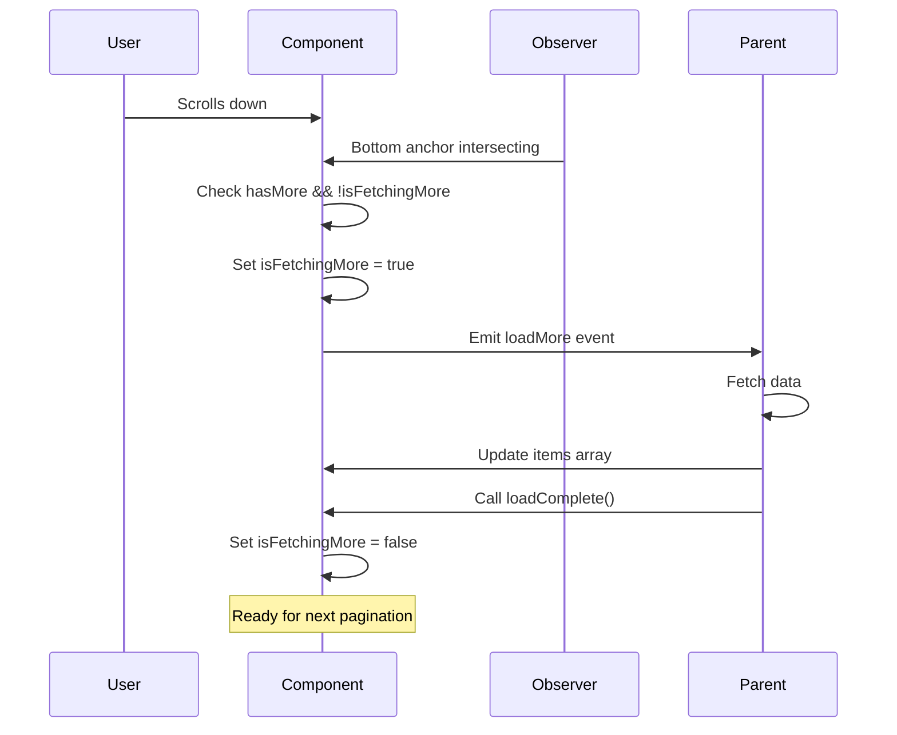

## Overview

The CometChatPaginatedList component is a generic, reusable component designed for implementing infinite scroll lists. It handles pagination, loading states, empty states, and error states while using the IntersectionObserver API for efficient scroll detection.

This component is part of the enterprise refactoring architecture and serves as the foundation for list-based components like CometChatConversations, CometChatUsers, and CometChatGroups.

### Key Features

- **Generic Type Parameter**: Works with any item type via TypeScript generics (`<T>`)
- **IntersectionObserver**: Efficient scroll detection without scroll event listeners
- **State Management**: Built-in handling for loading, empty, and error states
- **Template Customization**: Full control over item rendering and state views
- **Performance Optimized**: OnPush change detection and trackBy support
- **Accessibility**: ARIA attributes and roles for screen reader support

### Architecture Benefits

- **Reusable**: Single implementation for all list-based components
- **Consistent**: Uniform pagination behavior across the SDK
- **Efficient**: IntersectionObserver is more performant than scroll events
- **Flexible**: Template-based customization for any use case


<Info>
  **Live Preview** — default paginated list preview.
  [Open in Storybook ↗](https://storybook.cometchat.io/angular/?path=/story/components-misc-paginated-list--default)
</Info>

<iframe
  src="https://storybook.cometchat.io/angular/iframe.html?id=components-misc-paginated-list--default&viewMode=story&shortcuts=false&singleStory=true"
  className="w-full rounded-xl"
  loading="lazy"
  style={{height: "500px", border: "1px solid #e0e0e0"}}
  title="CometChat Paginated List — Default"
  allow="clipboard-write"
></iframe>

## Basic Usage

### Simple Implementation

```typescript expandable
import { Component } from '@angular/core';
import { CometChatPaginatedListComponent } from '@cometchat/chat-uikit-angular';

interface User {
  id: string;
  name: string;
  avatar: string;
}

@Component({
  selector: 'app-user-list',
  standalone: true,
  imports: [CometChatPaginatedListComponent],
  template: `
    <cometchat-paginated-list
      [items]="users"
      [trackByFn]="trackByUserId"
      [isLoading]="isLoading"
      [hasMore]="hasMore"
      [itemTemplate]="userTemplate"
      (loadMore)="onLoadMore()"
    >
      <ng-template #userTemplate let-user let-index="index">
        <div class="user-item">
          
          <span>{{ user.name }}</span>
        </div>
      </ng-template>
    </cometchat-paginated-list>
  `
})
export class UserListComponent {
  users: User[] = [];
  isLoading = false;
  hasMore = true;

  trackByUserId = (index: number, user: User) => user.id;

  onLoadMore(): void {
    // Fetch more users
    this.fetchUsers();
  }

  private fetchUsers(): void {
    // Implementation
  }
}
```

### With All State Templates

```typescript expandable
import { Component, ViewChild } from '@angular/core';
import { CometChatPaginatedListComponent } from '@cometchat/chat-uikit-angular';

@Component({
  selector: 'app-complete-list',
  standalone: true,
  imports: [CometChatPaginatedListComponent],
  template: `
    <cometchat-paginated-list
      #paginatedList
      [items]="items"
      [trackByFn]="trackByFn"
      [isLoading]="isLoading"
      [hasMore]="hasMore"
      [error]="error"
      [showScrollbar]="true"
      [itemTemplate]="itemTemplate"
      [loadingTemplate]="loadingTemplate"
      [emptyTemplate]="emptyTemplate"
      [errorTemplate]="errorTemplate"
      [loadingMoreTemplate]="loadingMoreTemplate"
      (loadMore)="onLoadMore()"
      (scrollToTop)="onScrollToTop()"
      (scrollToBottom)="onScrollToBottom()"
      (itemClick)="onItemClick($event)"
    >
      <!-- Item Template -->
      <ng-template #itemTemplate let-item let-index="index">
        <div class="list-item">{{ item.name }}</div>
      </ng-template>

      <!-- Loading Template -->
      <ng-template #loadingTemplate>
        <div class="loading-state">
          <div class="spinner"></div>
          <p>Loading items...</p>
        </div>
      </ng-template>

      <!-- Empty Template -->
      <ng-template #emptyTemplate>
        <div class="empty-state">
          
          <h3>No Items Found</h3>
          <p>Start by adding some items</p>
        </div>
      </ng-template>

      <!-- Error Template -->
      <ng-template #errorTemplate let-error>
        <div class="error-state">
          
          <h3>Something went wrong</h3>
          <p>{{ error.message }}</p>
          <button (click)="retry()">Try Again</button>
        </div>
      </ng-template>

      <!-- Loading More Template -->
      <ng-template #loadingMoreTemplate>
        <div class="loading-more">
          <div class="small-spinner"></div>
        </div>
      </ng-template>
    </cometchat-paginated-list>
  `
})
export class CompleteListComponent {
  @ViewChild('paginatedList') paginatedList!: CometChatPaginatedListComponent<any>;
  
  items: any[] = [];
  isLoading = false;
  hasMore = true;
  error: Error | null = null;

  trackByFn = (index: number, item: any) => item.id;

  async onLoadMore(): Promise<void> {
    try {
      const newItems = await this.fetchItems();
      this.items = [...this.items, ...newItems];
      this.hasMore = newItems.length > 0;
    } catch (err) {
      this.error = err as Error;
    } finally {
      // Important: Call loadComplete() when done
      this.paginatedList.loadComplete();
    }
  }

  onScrollToTop(): void {
    console.log('Scrolled to top');
  }

  onScrollToBottom(): void {
    console.log('Scrolled to bottom');
  }

  onItemClick(event: { item: any; index: number }): void {
    console.log('Item clicked:', event.item, 'at index:', event.index);
  }

  retry(): void {
    this.error = null;
    this.onLoadMore();
  }

  private async fetchItems(): Promise<any[]> {
    // Implementation
    return [];
  }
}
```

## Properties

### Data Input Properties

| Property | Type | Default | Description |
|----------|------|---------|-------------|
| `items` | `T[]` | `[]` | Array of items to display in the list |
| `trackByFn` | `(index: number, item: T) => any` | `(index) => index` | Function to track items for efficient rendering |

### State Input Properties

| Property | Type | Default | Description |
|----------|------|---------|-------------|
| `isLoading` | `boolean` | `false` | Whether the list is currently loading initial data |
| `hasMore` | `boolean` | `true` | Whether there are more items to load |
| `error` | `Error \| null` | `null` | Error object if an error occurred |

### Display Input Properties

| Property | Type | Default | Description |
|----------|------|---------|-------------|
| `showScrollbar` | `boolean` | `false` | Whether to show the scrollbar |
| `loadingThreshold` | `number` | `100` | Distance from bottom (in pixels) to trigger load more |
| `observeScrollFromViewport` | `boolean` | `false` | When `true`, uses viewport-based scroll observation instead of the list container's scroll. Useful when the list is inside a scrollable parent. |
| `ariaLabel` | `string` | `''` | ARIA label for the list container |
| `enableKeyboardNavigation` | `boolean` | `true` | Whether keyboard navigation is enabled |
| `isMultiSelect` | `boolean` | `false` | Whether the list supports multiple selection |
| `emptyStateAriaLabel` | `string` | `''` | ARIA label for the empty state |
| `errorStateAriaLabel` | `string` | `''` | ARIA label for the error state |
| `hideError` | `boolean` | `false` | Whether to hide the error state |
| `isItemSelected` | `(item: T) => boolean` | `() => false` | Function to check if an item is selected |

### Template Input Properties

| Property | Type | Default | Description |
|----------|------|---------|-------------|
| `itemTemplate` | `TemplateRef<{$implicit: T, index: number}>` | `undefined` | Template for rendering each item |
| `loadingTemplate` | `TemplateRef<void>` | `undefined` | Template for initial loading state |
| `emptyTemplate` | `TemplateRef<void>` | `undefined` | Template for empty state (no items) |
| `errorTemplate` | `TemplateRef<{$implicit: Error}>` | `undefined` | Template for error state |
| `loadingMoreTemplate` | `TemplateRef<void>` | `undefined` | Template for loading more indicator |

## Events

| Event | Payload Type | Description |
|-------|-------------|-------------|
| `loadMore` | `void` | Emitted when more items should be loaded (user scrolled near bottom) |
| `scrollToTop` | `void` | Emitted when the list is scrolled to the top |
| `scrollToBottom` | `void` | Emitted when the list is scrolled to the bottom |
| `itemClick` | `{item: T, index: number}` | Emitted when an item is clicked |
| `focusedIndexChange` | `number` | Emitted when the focused index changes during keyboard navigation |
| `retry` | `void` | Emitted when retry is triggered from the error state |

## Public Methods

The component exposes several public methods that can be called via ViewChild:

| Method | Parameters | Description |
|--------|------------|-------------|
| `loadComplete()` | None | Call when load operation completes to reset fetching state |
| `scrollToTopPosition()` | None | Programmatically scroll the list to the top |
| `scrollToBottomPosition()` | None | Programmatically scroll the list to the bottom |

### Using Public Methods

```typescript expandable
import { Component, ViewChild } from '@angular/core';
import { CometChatPaginatedListComponent } from '@cometchat/chat-uikit-angular';

@Component({
  selector: 'app-list-with-controls',
  template: `
    <div class="controls">
      <button (click)="scrollToTop()">Scroll to Top</button>
      <button (click)="scrollToBottom()">Scroll to Bottom</button>
    </div>
    
    <cometchat-paginated-list
      #paginatedList
      [items]="items"
      [hasMore]="hasMore"
      (loadMore)="onLoadMore()"
    ></cometchat-paginated-list>
  `
})
export class ListWithControlsComponent {
  @ViewChild('paginatedList') paginatedList!: CometChatPaginatedListComponent<any>;
  
  items: any[] = [];
  hasMore = true;

  scrollToTop(): void {
    this.paginatedList.scrollToTopPosition();
  }

  scrollToBottom(): void {
    this.paginatedList.scrollToBottomPosition();
  }

  async onLoadMore(): Promise<void> {
    const newItems = await this.fetchItems();
    this.items = [...this.items, ...newItems];
    
    // IMPORTANT: Always call loadComplete() when done loading
    this.paginatedList.loadComplete();
  }

  private async fetchItems(): Promise<any[]> {
    // Implementation
    return [];
  }
}
```

## Generic Type Parameter

The component uses TypeScript generics to provide type safety for any item type:

### Type-Safe Usage

```typescript expandable
import { Component } from '@angular/core';
import { CometChat } from '@cometchat/chat-sdk-javascript';
import { CometChatPaginatedListComponent } from '@cometchat/chat-uikit-angular';

// Define your item type
interface Conversation {
  id: string;
  name: string;
  lastMessage: string;
  timestamp: number;
}

@Component({
  selector: 'app-typed-list',
  standalone: true,
  imports: [CometChatPaginatedListComponent],
  template: `
    <cometchat-paginated-list
      [items]="conversations"
      [trackByFn]="trackByConversationId"
      [itemTemplate]="conversationTemplate"
      (loadMore)="loadMoreConversations()"
      (itemClick)="onConversationClick($event)"
    >
      <ng-template #conversationTemplate let-conversation let-index="index">
        <!-- TypeScript knows 'conversation' is of type Conversation -->
        <div class="conversation-item">
          <h4>{{ conversation.name }}</h4>
          <p>{{ conversation.lastMessage }}</p>
          <span>{{ conversation.timestamp | date:'short' }}</span>
        </div>
      </ng-template>
    </cometchat-paginated-list>
  `
})
export class TypedListComponent {
  conversations: Conversation[] = [];

  // Type-safe trackBy function
  trackByConversationId = (index: number, conversation: Conversation): string => {
    return conversation.id;
  };

  loadMoreConversations(): void {
    // Implementation
  }

  // Type-safe event handler
  onConversationClick(event: { item: Conversation; index: number }): void {
    console.log('Clicked conversation:', event.item.name);
  }
}
```

### Using with CometChat SDK Types

```typescript expandable
import { Component } from '@angular/core';
import { CometChat } from '@cometchat/chat-sdk-javascript';
import { CometChatPaginatedListComponent } from '@cometchat/chat-uikit-angular';

@Component({
  selector: 'app-sdk-list',
  standalone: true,
  imports: [CometChatPaginatedListComponent],
  template: `
    <cometchat-paginated-list
      [items]="users"
      [trackByFn]="trackByUid"
      [itemTemplate]="userTemplate"
      (loadMore)="loadMoreUsers()"
    >
      <ng-template #userTemplate let-user>
        <div class="user-item">
          
          <span>{{ user.getName() }}</span>
          <span class="status">{{ user.getStatus() }}</span>
        </div>
      </ng-template>
    </cometchat-paginated-list>
  `
})
export class SDKListComponent {
  users: CometChat.User[] = [];

  trackByUid = (index: number, user: CometChat.User): string => {
    return user.getUid();
  };

  loadMoreUsers(): void {
    // Use CometChat SDK to fetch users
  }
}
```

## Infinite Scroll Behavior

### How IntersectionObserver Works

The component uses the IntersectionObserver API instead of scroll event listeners for better performance:

1. **Bottom Anchor**: A hidden element at the bottom of the list is observed
2. **Intersection Detection**: When the bottom anchor becomes visible (intersects with viewport), pagination is triggered
3. **Debouncing**: The `isFetchingMore` signal prevents duplicate requests
4. **Completion**: Parent must call `loadComplete()` to allow subsequent loads

### Pagination Flow



### Preventing Duplicate Requests

```typescript expandable
@Component({
  selector: 'app-safe-pagination',
  template: `
    <cometchat-paginated-list
      #list
      [items]="items"
      [hasMore]="hasMore"
      [isLoading]="isLoading"
      (loadMore)="onLoadMore()"
    ></cometchat-paginated-list>
  `
})
export class SafePaginationComponent {
  @ViewChild('list') list!: CometChatPaginatedListComponent<any>;
  
  items: any[] = [];
  hasMore = true;
  isLoading = false;

  async onLoadMore(): Promise<void> {
    // The component's internal isFetchingMore signal prevents
    // this from being called multiple times simultaneously
    
    try {
      const newItems = await this.fetchItems();
      
      if (newItems.length === 0) {
        this.hasMore = false; // No more items to load
      } else {
        this.items = [...this.items, ...newItems];
      }
    } catch (error) {
      console.error('Failed to load items:', error);
    } finally {
      // CRITICAL: Always call loadComplete() to reset the fetching state
      this.list.loadComplete();
    }
  }

  private async fetchItems(): Promise<any[]> {
    // Your API call here
    return [];
  }
}
```

## Template Customization

### Item Template Context

The item template receives the following context:

```typescript
interface ItemTemplateContext<T> {
  $implicit: T;  // The item (accessible via let-item)
  index: number; // The item's index (accessible via let-index="index")
}
```

### Custom Item Template

```typescript expandable
<cometchat-paginated-list [items]="messages" [itemTemplate]="messageTemplate">
  <ng-template #messageTemplate let-message let-index="index">
    <div class="message" [class.even]="index % 2 === 0">
      <span class="index">#{{ index + 1 }}</span>
      <span class="sender">{{ message.sender }}</span>
      <span class="text">{{ message.text }}</span>
      <span class="time">{{ message.timestamp | date:'shortTime' }}</span>
    </div>
  </ng-template>
</cometchat-paginated-list>
```

### Error Template Context

The error template receives the Error object:

```typescript expandable
<ng-template #errorTemplate let-error>
  <div class="error-container">
    <h3>Error: {{ error.name }}</h3>
    <p>{{ error.message }}</p>
    @if (showDebug) {
      <pre>{{ error.stack }}</pre>
    }
    <button (click)="retry()">Retry</button>
  </div>
</ng-template>
```

### Loading States

```typescript expandable
<cometchat-paginated-list
  [items]="items"
  [isLoading]="isLoading"
  [loadingTemplate]="loadingTemplate"
  [loadingMoreTemplate]="loadingMoreTemplate"
>
  <!-- Initial loading (full screen) -->
  <ng-template #loadingTemplate>
    <div class="initial-loading">
      <div class="skeleton-list">
        @for (i of [1,2,3,4,5]; track i) {
        <div class="skeleton-item">
          <div class="skeleton-avatar"></div>
          <div class="skeleton-content">
            <div class="skeleton-line"></div>
            <div class="skeleton-line short"></div>
          </div>
        </div>
      </div>
    </div>
  </ng-template>

  <!-- Loading more (bottom indicator) -->
  <ng-template #loadingMoreTemplate>
    <div class="loading-more">
      <div class="dots-loader">
        <span></span>
        <span></span>
        <span></span>
      </div>
    </div>
  </ng-template>
</cometchat-paginated-list>
```

## Styling with CSS Variables

The component uses CSS variables for theming, inheriting from the conversations component variables:

```css expandable
cometchat-paginated-list {
  /* Container */
  --cometchat-conversations-background: var(--cometchat-background-color-01);
  
  /* Error state */
  --cometchat-conversations-error-min-height: 200px;
  --cometchat-conversations-error-padding: var(--cometchat-spacing-8) var(--cometchat-spacing-4);
  --cometchat-conversations-error-gap: var(--cometchat-spacing-4);
  --cometchat-conversations-error-message-font: var(--cometchat-font-body-regular);
  --cometchat-conversations-error-icon-color: var(--cometchat-error-color);
  
  /* Empty state */
  --cometchat-conversations-empty-min-height: 300px;
  --cometchat-conversations-empty-padding: var(--cometchat-spacing-8) var(--cometchat-spacing-4);
  --cometchat-conversations-empty-gap: var(--cometchat-spacing-4);
  
  /* Pagination spinner */
  --cometchat-conversations-pagination-spinner-size: 24px;
  --cometchat-conversations-pagination-spinner-color: var(--cometchat-primary-color);
}
```

### Custom Styling Example

```css expandable
/* Custom themed paginated list */
.custom-list cometchat-paginated-list {
  --cometchat-conversations-background: #f5f5f5;
  --cometchat-conversations-pagination-spinner-color: #FF6B35;
  --cometchat-conversations-error-icon-color: #FF3B30;
}

/* Dark theme */
.dark-theme cometchat-paginated-list {
  --cometchat-conversations-background: #1a1a1a;
  --cometchat-background-color-02: #2a2a2a;
  --cometchat-background-color-03: #333333;
  --cometchat-neutral-color-400: #666666;
}
```

### Scrollbar Customization

```css
/* Custom scrollbar when showScrollbar is true */
cometchat-paginated-list {
  --cometchat-background-color-02: #f0f0f0;
  --cometchat-neutral-color-400: #999999;
}
```

## Accessibility

The CometChatPaginatedList component includes comprehensive accessibility features:

### ARIA Attributes

- `role="list"` on the main container
- `role="listitem"` on each item wrapper
- `aria-busy` indicates loading state
- `aria-live="polite"` on loading and error regions for screen reader announcements
- `aria-hidden="true"` on scroll anchors (they're for IntersectionObserver only)
- `role="status"` on loading indicators
- `role="alert"` on error messages

### Screen Reader Support

The component announces:
- Loading state changes
- Error messages
- Empty state (when no items)

### Focus Management

- Items are focusable via click handlers
- Parent components can implement keyboard navigation
- Focus indicators are inherited from item templates

## Integration Examples

### With CometChatConversations

The CometChatConversations component uses CometChatPaginatedList internally:

```typescript expandable
// Internal usage in CometChatConversations
<cometchat-paginated-list
  [items]="conversations()"
  [trackByFn]="trackByConversationId"
  [isLoading]="isLoading()"
  [hasMore]="hasMore()"
  [error]="error()"
  [showScrollbar]="showScrollbar"
  [itemTemplate]="conversationItemTemplate"
  [loadingTemplate]="loadingView"
  [emptyTemplate]="emptyView"
  [errorTemplate]="errorView"
  (loadMore)="loadMoreConversations()"
  (itemClick)="onConversationClick($event)"
></cometchat-paginated-list>
```

### Building a Custom List Component

```typescript expandable
import { Component, Input, Output, EventEmitter, ViewChild } from '@angular/core';
import { CometChat } from '@cometchat/chat-sdk-javascript';
import { CometChatPaginatedListComponent } from '@cometchat/chat-uikit-angular';

@Component({
  selector: 'app-custom-users-list',
  standalone: true,
  imports: [CometChatPaginatedListComponent],
  template: `
    <div class="users-list-container">
      <header class="users-header">
        <h2>{{ title }}</h2>
        <input 
          type="search" 
          placeholder="Search users..."
          (input)="onSearch($event)"
        />
      </header>
      
      <cometchat-paginated-list
        #usersList
        [items]="users"
        [trackByFn]="trackByUid"
        [isLoading]="isLoading"
        [hasMore]="hasMore"
        [error]="error"
        [showScrollbar]="true"
        [itemTemplate]="userTemplate"
        [emptyTemplate]="emptyTemplate"
        (loadMore)="onLoadMore()"
        (itemClick)="onUserClick($event)"
      >
        <ng-template #userTemplate let-user>
          <div class="user-item">
            
            <div class="user-info">
              <span class="name">{{ user.getName() }}</span>
              <span class="status" [class.online]="user.getStatus() === 'online'">
                {{ user.getStatus() }}
              </span>
            </div>
          </div>
        </ng-template>
        
        <ng-template #emptyTemplate>
          <div class="empty-users">
            <p>No users found</p>
          </div>
        </ng-template>
      </cometchat-paginated-list>
    </div>
  `
})
export class CustomUsersListComponent {
  @ViewChild('usersList') usersList!: CometChatPaginatedListComponent<CometChat.User>;
  
  @Input() title = 'Users';
  @Output() userSelected = new EventEmitter<CometChat.User>();
  
  users: CometChat.User[] = [];
  isLoading = false;
  hasMore = true;
  error: Error | null = null;
  
  private usersRequest!: CometChat.UsersRequest;

  trackByUid = (index: number, user: CometChat.User) => user.getUid();

  ngOnInit(): void {
    this.initializeRequest();
    this.loadUsers();
  }

  private initializeRequest(): void {
    this.usersRequest = new CometChat.UsersRequestBuilder()
      .setLimit(30)
      .build();
  }

  async loadUsers(): Promise<void> {
    this.isLoading = true;
    try {
      const fetchedUsers = await this.usersRequest.fetchNext();
      this.users = [...this.users, ...fetchedUsers];
      this.hasMore = fetchedUsers.length > 0;
    } catch (err) {
      this.error = err as Error;
    } finally {
      this.isLoading = false;
    }
  }

  async onLoadMore(): Promise<void> {
    try {
      const fetchedUsers = await this.usersRequest.fetchNext();
      this.users = [...this.users, ...fetchedUsers];
      this.hasMore = fetchedUsers.length > 0;
    } catch (err) {
      this.error = err as Error;
    } finally {
      this.usersList.loadComplete();
    }
  }

  onUserClick(event: { item: CometChat.User; index: number }): void {
    this.userSelected.emit(event.item);
  }

  onSearch(event: Event): void {
    const query = (event.target as HTMLInputElement).value;
    // Implement search logic
  }
}
```

## Best Practices

<Tip>
  Always call `loadComplete()` after your load operation finishes (success or failure). This resets the internal fetching state and allows subsequent pagination requests.
</Tip>

<Warning>
  The component uses `OnPush` change detection. When updating the `items` array, create a new array reference (`this.items = [...this.items, ...newItems]`) instead of mutating the existing array.
</Warning>

<Info>
  The `trackByFn` function is crucial for performance. Always provide a function that returns a unique identifier for each item to enable efficient DOM updates.
</Info>

<Tip>
  Set `hasMore` to `false` when there are no more items to load. This prevents unnecessary pagination requests and hides the loading more indicator.
</Tip>

<Warning>
  Don't rely on scroll events for custom logic. The component uses IntersectionObserver internally. Use the provided events (`scrollToTop`, `scrollToBottom`, `loadMore`) instead.
</Warning>

## Technical Details

- **Standalone Component**: Can be imported and used independently
- **Change Detection**: Uses `OnPush` strategy for optimal performance
- **Scroll Detection**: IntersectionObserver API (not scroll events)
- **State Management**: Angular signals for reactive internal state
- **Dependencies**: CommonModule only
- **BEM CSS**: Follows Block Element Modifier naming convention
- **Accessibility**: WCAG 2.1 Level AA compliant

## Related Components

- **CometChatConversations**: Uses CometChatPaginatedList for conversation list rendering
- **CometChatConversationItem**: Item component used within conversation lists
- **CometChatUsers**: Uses CometChatPaginatedList for user list rendering
- **CometChatGroups**: Uses CometChatPaginatedList for group list rendering
